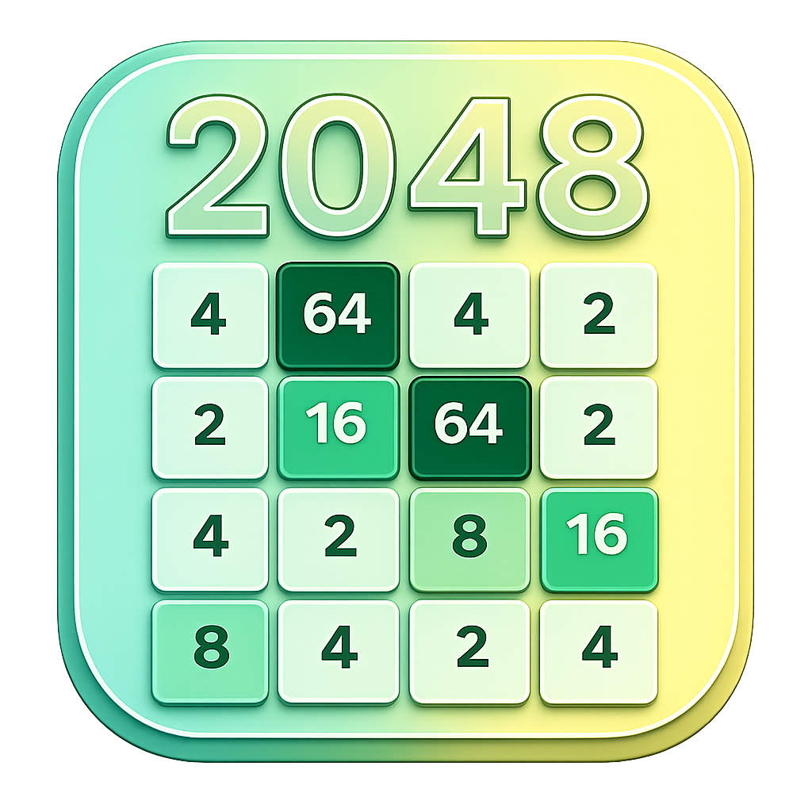

# 🎮 2048 Game

A modern Flutter implementation of the classic **2048 puzzle game** with smooth animations, multiple grid sizes, and a clean user interface.

<p align="center">
  
</p>

---

## Overview

2048 Game is a mobile puzzle application where players slide numbered tiles across a grid to combine them and reach the **2048 tile**. This version enhances the classic experience with customizable board sizes, theme support, and polished UI interactions.

---

## Features

- Multiple grid sizes: 4×4, 5×5, 6×6, 8×8
- Swipe-based tile movement
- Score and best score tracking
- Undo last move
- Restart game anytime
- Win and game-over states
- Light and dark theme support
- Smooth animations and modern UI

---

## Built With

- **Flutter**
- **Dart**

---

## Dependencies

- shared_preferences
- google_fonts

---

## ▶️ Getting Started

```bash
flutter pub get
flutter run
```
