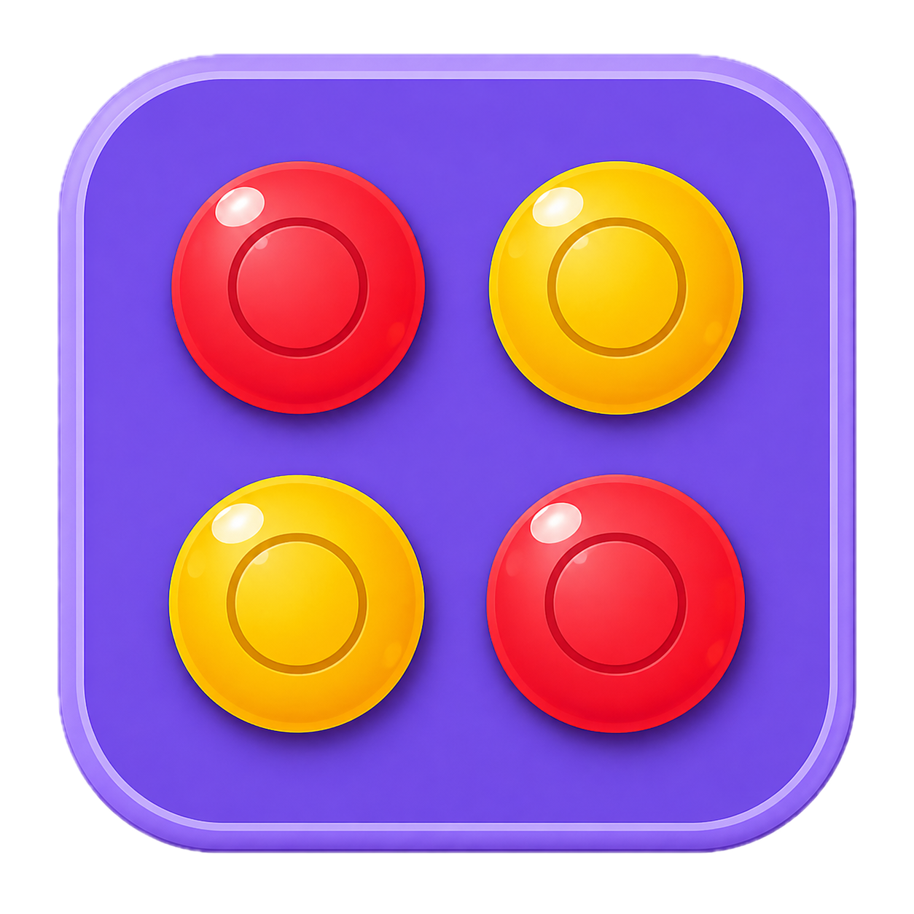

# 🎲 Board Games

> A curated collection of classic board & puzzle games rebuilt in Flutter — showcasing clean UI, smooth animations, and solid state-management patterns across single- and multiplayer experiences.

---

## 📱 Project Overview

This portfolio demonstrates expertise in creating polished, production-ready Flutter games with a focus on: </br>
✨ Classic Gameplay Reimagined — faithful mechanics with a modern mobile-first UI </br>
✨ Cross-Platform Excellence — optimized performance across iOS and Android </br>
✨ Smart Opponents — AI-driven single-player modes alongside local multiplayer </br>
✨ State Management Variety — GetX, Riverpod & `shared_preferences` used where they fit best </br>
✨ Smooth Animations — tile transitions, dice rolls, disc drops & token movement </br>

---

## 🧩 2048 Game

A modern Flutter implementation of the classic **2048 puzzle game** with smooth animations, multiple grid sizes, and a clean user interface.

<p align="center">
  
</p>

#### ✨ Key Features
🔢 **Multiple Grid Sizes** — 4×4, 5×5, 6×6 & 8×8 boards </br>
👆 **Swipe-Based Movement** — natural, gesture-driven tile sliding </br>
📊 **Score Tracking** — live score plus persisted best score </br>
↩️ **Undo & Restart** — take back the last move or start fresh anytime </br>
🌗 **Light & Dark Themes** — clean UI in either mode </br>

#### 🛠️ Technical Highlights
🔹 Flutter + Dart, no external state-management dependency </br>
🔹 `shared_preferences` for persisting best score & settings </br>
🔹 `google_fonts` for consistent modern typography </br>

📄 [Full README →](2048_Game/README.md)

---

## 🔴 Connect 4 Game

A modern Flutter-based implementation of the classic **Connect 4 (Four-in-a-Row)** board game. Play against an AI opponent or challenge a friend locally with a smooth, responsive, and visually polished mobile experience.

<p align="center">
  
</p>

#### ✨ Key Features
🤖 **Single-Player AI** — with Easy, Medium & Hard difficulty levels </br>
👥 **Two-Player Pass-and-Play** — local head-to-head matches </br>
🧠 **Gravity-Based Disc Placement** — smart move handling </br>
🏆 **Win & Draw Detection** — horizontal, vertical & diagonal checks </br>
📊 **Score Tracking** — across matches, with a settings panel for theme & preferences </br>

#### 🛠️ Technical Highlights
🔸 Flutter + Dart with **Riverpod** for state management </br>
🔸 Modern, responsive UI with `google_fonts` </br>

📄 [Full README →](Connect_4_Game/README.md)

---

## 🎲 Ludo Kingdom

A modern Flutter implementation of the classic **Ludo** board game, built on the **Flame** game engine with GetX state management. Roll the dice, race your tokens home, and battle friends or AI opponents in a polished, animated arena.

<p align="center">
  
</p>

#### ✨ Key Features
🤖 **VS Computer** — take on 3 AI-controlled opponents </br>
👥 **2 / 3 / 4 Player Modes** — flexible local pass-and-play </br>
🎲 **Animated Dice Rolling** — with automatic CPU turns </br>
♟️ **Flame-Powered Board** — rendered token & board animations </br>
🏆 **Win Detection & Results Screen** — once all tokens reach home </br>

#### 🛠️ Technical Highlights
🔶 Flutter + Dart with **GetX** for routing & state management </br>
🔶 **Flame** 2D game engine for board/token rendering </br>
🔶 `audioplayers` for in-game sound effects </br>

📄 [Full README →](Ludo_App_Demo/README.md)

---

## 🛠️ Tech Stack Summary

| Project | State Management | Notable Packages |
|---|---|---|
| 2048 Game | Local widget state | `shared_preferences`, `google_fonts` |
| Connect 4 Game | Riverpod | `flutter_riverpod`, `google_fonts` |
| Ludo Kingdom | GetX | `flame`, `audioplayers`, `google_fonts` |

---

## ▶️ Getting Started

Each game is an independent Flutter project. Pick one and run:

```bash
cd <project_folder>   # 2048_Game, Connect_4_Game, or Ludo_App_Demo
flutter pub get
flutter run
```

---

*Built with ❤️ by DevCodeSpace using Flutter • Classic games, modern experience*
