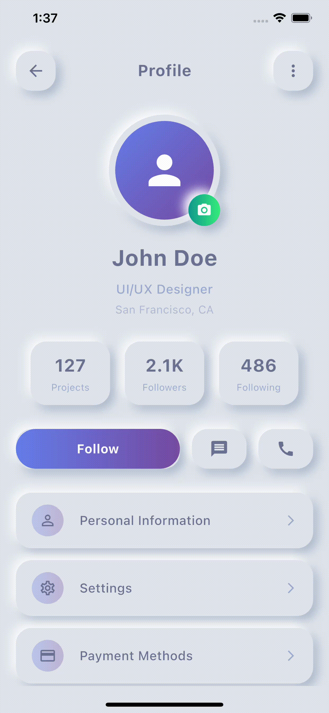

# 👤 Profimotion - Flutter Profile App

Beautiful Flutter profile app with stunning neumorphic UI and smooth animations. Experience elegant user profiles with advanced animation techniques and modern design patterns.

### App Animation Showcase 🎯




## ✨ Features

🎨 **Neumorphic Design** - Beautiful soft UI with shadows and depth effects </br>
👤 **Animated Profile** - Dynamic avatar with rotating camera button </br>
📊 **Stats Display** - Projects, followers & following with smooth animations </br>
🎯 **Interactive Actions** - Follow, message & call with animated feedback </br>
⚡ **Smooth Animations** - Elastic scaling, slide-in effects & staggered lists </br>

## 📱 App Structure

### 🎨 Profile Screen
🎯 Neumorphic containers with soft shadow effects </br>
🎯 Animated profile avatar with gradient background </br>
🎯 Stats cards with elastic entrance animations </br>
🎯 Action buttons with follow/unfollow functionality </br>
🎯 Staggered menu items with slide-in effects </br>

### 🔧 Controller Architecture
🎯 Multiple animation controllers for different sections </br>
🎯 Reactive state management with GetX observables </br>
🎯 User profile model with complete data structure </br>
🎯 Interactive menu with dynamic functionality </br>

## 🎨 Animation Magic

### Core Techniques
🔥 **AnimationController** - Multiple controllers for complex sequences </br>
🔥 **Tween & Curves** - Elastic, bounce and ease-out motion effects </br>
🔥 **Transform** - Scale, translate & rotation animations </br>

### Advanced Features
⚡ **Staggered Animations** - Sequential menu entrance with delays </br>
⚡ **Neumorphic Effects** - Soft UI with realistic shadow depth </br>
⚡ **Interactive Feedback** - Button press states and smooth transitions </br>

## 🛠️ Project Structure

```
lib/
├── main.dart                      # Entry point with GetX setup
├── Controller/
│   └── profile_controller.dart    # Profile logic & animations
├── Model/
│   └── user_profile_model.dart    # User data structure
├── View/
│   ├── profile_screen.dart        # Neumorphic profile UI
│   └── neumorphic_container.dart  # Reusable neumorphic widget
└── Routes/
    ├── app_pages.dart             # Route definitions
    ├── app_routes.dart            # Route constants
    └── binding.dart               # Dependency injection
```

## 🎯 Key Highlights

💡 **Performance Optimized** - Efficient rebuilds with AnimatedBuilder </br>
💡 **Memory Safe** - Proper controller disposal in onClose </br>
💡 **Responsive Design** - Adaptive layouts for all devices </br>
💡 **Modern Architecture** - GetX pattern with clean separation </br>


---

*Built with ❤️ DevCodeSpace using Flutter • Showcasing innovation in mobile development*