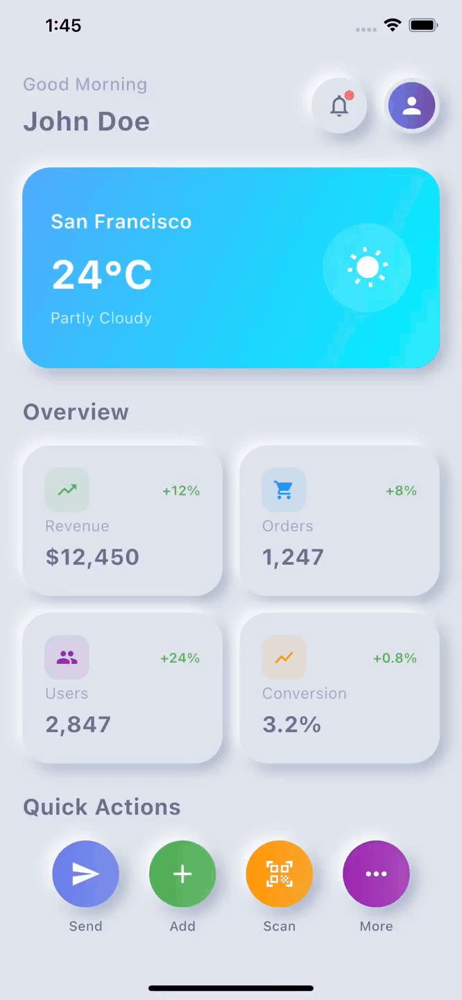
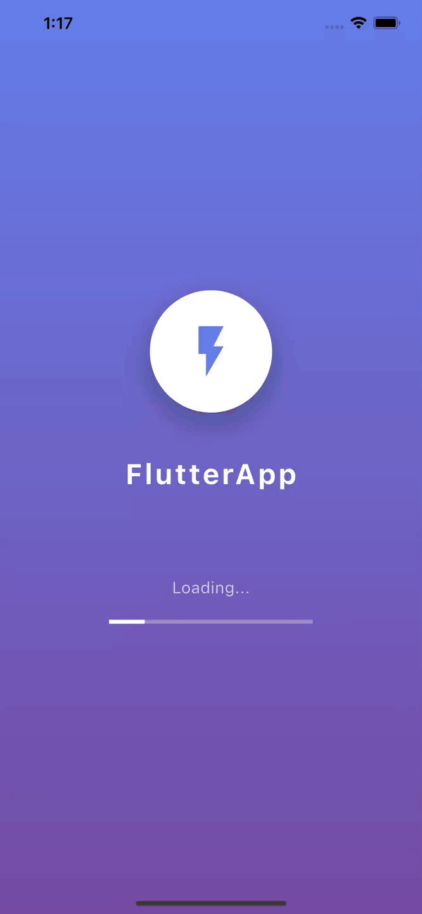

# 🎨 Flutter Animation 

> A curated collection of modern Flutter applications showcasing cutting-edge design animation patterns, exceptional user experiences, and innovative technical implementations across diverse industry verticals.

---

## 📱 Project Overview

This portfolio demonstrates expertise in creating polished, production-ready Flutter applications with focus on:  
✨ Modern Animation Design - Following latest animation design trends and Material animation Design principles  
✨ Cross-Platform Excellence - Optimized performance across iOS and Android  
✨ Real-World Applications - Practical solutions for various business domains  
✨ Technical Innovation - Advanced features and integrations  
✨ Stunning Animations - Smooth micro-interactions, page transitions, and engaging visual effects  
✨ Interactive Elements - Touch-responsive components with haptic feedback and gesture recognition  

---

## 👤 Profimotion - Flutter Profile App

Beautiful Flutter profile app with stunning neumorphic UI and smooth animations. Experience elegant user profiles with advanced animation techniques and modern design patterns.

#### ✨ Key Features
🎨 **Neumorphic Design** - Beautiful soft UI with shadows and depth effects  
👤 **Animated Profile** - Dynamic avatar with rotating camera button  
📊 **Stats Display** - Projects, followers & following with smooth animations  
🎯 **Interactive Actions** - Follow, message & call with animated feedback  
⚡ **Smooth Animations** - Elastic scaling, slide-in effects & staggered lists  

#### 🛠️ Technical Highlights
🔹 Efficient rebuilds with AnimatedBuilder  
🔹 Proper controller disposal in onClose  
🔹 Adaptive layouts for all devices  
🔹 GetX pattern with clean separation

---

## 🔐 Signimatic - Flutter Login App

Beautiful Flutter login app with stunning glass morphism UI and smooth animations. Experience elegant authentication flows with advanced animation techniques and modern design patterns.

#### ✨ Key Features
🎨 **Glass Morphism UI** - Beautiful translucent cards with backdrop blur effects  
🌟 **Animated Background** - Dynamic gradient colors with floating particles  
🔒 **Secure Login Form** - Email & password validation with visibility toggle  
📱 **Social Authentication** - Google, Apple & Facebook login options  
🎯 **Smooth Animations** - Elastic scaling, slide-in effects & glow animations  

#### 🛠️ Technical Highlights
🔸 Efficient rebuilds with AnimatedBuilder  
🔸 Proper controller disposal in onClose  
🔸 Adaptive layouts for all devices  
🔸 GetX pattern with clean separation

---

## 📊 SkyBoard App

Beautiful Flutter dashboard app with stunning neumorphic UI and smooth animations. Experience elegant data visualization with advanced animation techniques and modern design patterns.

#### ✨ Key Features
🎨 **Neumorphic Design** - Beautiful soft UI with realistic shadows and depth  
📊 **Interactive Dashboard** - Dynamic stats cards with real-time data display  
🌤️ **Weather Widget** - Animated weather card with location & temperature  
⚡ **Quick Actions** - Floating action buttons with gradient backgrounds  
🔔 **Smart Notifications** - Pulsing indicators with interactive bottom sheets  

#### 🛠️ Technical Highlights  
🔶 Six controllers for orchestrated sequences  
🔶 Elastic, bounce and ease-out motion effects  
🔶 Scale, translate & rotation animations  
🔶 Sequential entrance with precise timing  

---

## 🎨 Soothly

Beautiful Flutter app with stunning animations and modern UI design. Experience smooth transitions, interactive dashboards, and delightful micro-interactions.

#### ✨ Key Features
🚀 **Animated Splash Screen** - Logo animations with elastic scaling & rotation  
🎯 **Interactive Onboarding** - Multi-page flow with smooth page transitions  
📊 **Dynamic Dashboard** - Animated cards, charts & floating action buttons  
🎨 **Modern UI Design** - Gradient backgrounds with beautiful shadows  
📱 **Responsive Layout** - Optimized for all screen sizes  

#### 🛠️ Technical Highlights  
◆ Lifecycle management  
◆ Sequential effects with delays  
◆ Bouncy, spring-like motions  
◆ Scale, rotate & translate widgets  

---

## 🎨 Wireless FTP Transfer

#### ✨ Key Features
🚀 **Transfer Method Selection** - Interactive cards with zoom-in animations for WiFi and Cloud options  
🎯 **Informative Pop-ups** - "Coming Soon!" pop-up with elastic rocket animation and ripple-effect buttons  
📊 **Visual Feedback Indicators** - Checkmark icons with bounce animations for key features like "Ultra-fast" and "Secure"  
🎨 **Color-Coded Design** - Gradient backgrounds (blue for WiFi, green for Cloud) with modern shadows  
📱 **Smooth Transitions** - Fade-in effects for titles, cards, and bullet points across screens  

#### 🛠️ Technical Highlights
🔹 Efficient rebuilds with AnimatedBuilder  
🔹 Bouncy, spring-like motions  
🔹 Scale, rotate & translate widgets  
🔹 Natural motion effects  

---

*Built with ❤️ DevCodeSpace using Flutter • Showcasing innovation in mobile development*