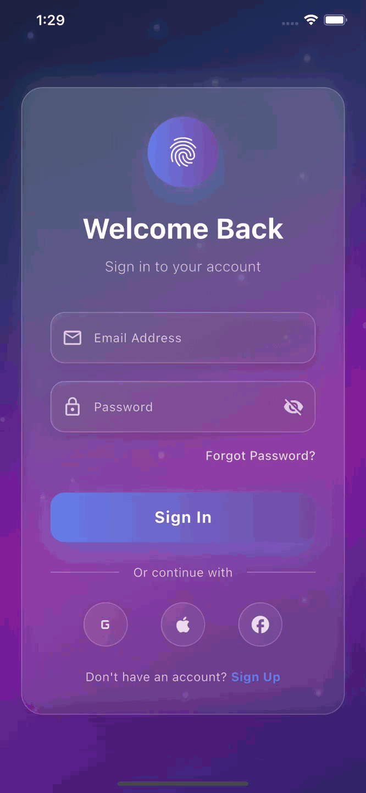

# 🔐 Signimatic - Flutter Login App

Beautiful Flutter login app with stunning glass morphism UI and smooth animations. Experience elegant authentication flows with advanced animation techniques and modern design patterns.

### App Animation Showcase 🎯




## ✨ Features

🎨 **Glass Morphism UI** - Beautiful translucent cards with backdrop blur effects </br>
🌟 **Animated Background** - Dynamic gradient colors with floating particles </br>
🔒 **Secure Login Form** - Email & password validation with visibility toggle </br>
📱 **Social Authentication** - Google, Apple & Facebook login options </br>
🎯 **Smooth Animations** - Elastic scaling, slide-in effects & glow animations </br>

## 📱 App Structure

### 🎨 Animated Login Screen
🎯 Dynamic gradient background with color transitions </br>
🎯 Floating particle system with random movement </br>
🎯 Glass morphism card with elastic entrance effects </br>
🎯 Staggered form field animations with fade-in </br>
🎯 Glowing login button with scale animations </br>

### 🔧 Controller Architecture
🎯 Multiple animation controllers for different elements </br>
🎯 Reactive state management with GetX observables </br>
🎯 Form validation and error handling </br>
🎯 Social login integration placeholders </br>

## 🎨 Animation Magic

### Core Techniques
🔥 **AnimationController** - Multiple controllers for complex sequences </br>
🔥 **Tween & Curves** - Elastic, bounce and linear motion effects </br>
🔥 **Transform** - Scale, translate & color interpolation </br>

### Advanced Features
⚡ **Staggered Animations** - Sequential field entrance with delays </br>
⚡ **Particle System** - Floating elements with random movement </br>
⚡ **Glass Morphism** - Translucent UI with blur effects </br>

## 🛠️ Project Structure

```
lib/
├── main.dart                    # Entry point with GetX setup
├── Controller/
│   └── login_controller.dart    # Login logic & animations
├── View/
│   └── login_screen.dart        # Glass morphism login UI
└── Routes/
    ├── app_pages.dart           # Route definitions
    ├── app_routes.dart          # Route constants
    └── binding.dart             # Dependency injection
```

## 🎯 Key Highlights

💡 **Performance Optimized** - Efficient rebuilds with AnimatedBuilder </br>
💡 **Memory Safe** - Proper controller disposal in onClose </br>
💡 **Responsive Design** - Adaptive layouts for all devices </br>
💡 **Modern Architecture** - GetX pattern with clean separation </br>


---

*Built with ❤️ DevCodeSpace using Flutter • Showcasing innovation in mobile development*