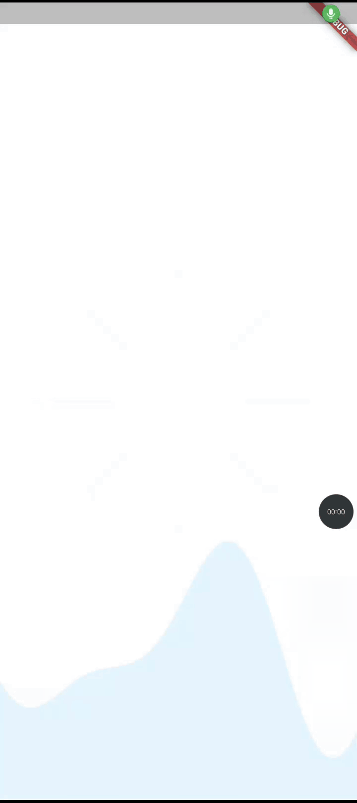

# 🎨 Wireless FTP Transfer - Flutter Animated App

Beautiful Flutter app with stunning animations and modern UI design. Experience smooth transitions, interactive dashboards, and delightful micro-interactions.

### App Animation Showcase 🎯


    

## ✨ Features

🚀 **Transfer Method Selection** - Interactive cards with zoom-in animations for WiFi and Cloud options </br>
🎯 **Informative Pop-ups** - "Coming Soon!" pop-up with elastic rocket animation and ripple-effect buttons </br>
📊 **Visual Feedback Indicators** - Checkmark icons with bounce animations for key features like "Ultra-fast" and "Secure" </br>
🎨 **Color-Coded Design** - Gradient backgrounds (blue for WiFi, green for Cloud) with modern shadows </br>
📱 **Smooth Transitions** - Fade-in effects for titles, cards, and bullet points across screens </br>

## 📱 App Structure

### 🎪 Splash Screen
🎯 Title "Wireless FTP File Transfer Made Easy" with elastic logo scaling and rotation effects </br>
🎯 Subtitle "Fast • Secure • Reliable" with subtle fade-in animation </br>
🎯 Animated progress bar with gradient background, pulsing effect during "Loading..." state </br>
🎯 Circular icon with folder and WiFi symbols, rotating and scaling with elastic animation </br>
🎯 Auto-navigation with fade transitions to the next screen </br>

### 🎨 Transfer Methods Screen  
🎯 Title "Transfer Methods" with subtle fade-in effect </br>
🎯 Info card with light bulb icon and description "Choose the best method based on your needs. Both options provide secure and reliable file transfer," sliding in from the left </br>
🎯 WiFi Transfer card with blue gradient background, featuring checkmark icons for "Ultra-fast," "No internet," and "Same network," with zoom-in animation </br>
🎯 Cloud Transfer card with green gradient background, featuring checkmark icons for "Remote access," "Link sharing," and "Secure," with zoom-in animation </br>

### 📱 Screen 3: Transfer Methods Screen with Pop-up
🎯 Title "Transfer Methods" with subtle fade-in effect (same as Screen 1) </br>
🎯 Info card with light bulb icon and description, sliding in from the left (same as Screen 1) </br>
🎯 WiFi Transfer card with blue gradient background, featuring checkmark icons, with zoom-in animation (same as Screen 1) </br>
🎯 Pop-up "Coming Soon!" card with rocket icon, elastic scale animation, and text "We’re working hard to bring you this exciting new feature. Stay tuned for updates!" fading in </br>
🎯 Pop-up buttons "Cloud Storage," "Sync," and "Secure" with subtle bounce animation </br>
🎯 "Got it" button with ripple effect on click, triggering a fade-out transition for the pop-up </br>

## 🎨 Animation Magic

### Core Techniques
🔥 **AnimationController** - Lifecycle management </br>
🔥 **Tween & Curves** - Natural motion effects </br>
🔥 **Transform** - Scale, rotate & translate widgets </br>

### Advanced Features
⚡ **Staggered Animations** - Sequential effects with delays </br>
⚡ **Elastic Curves** - Bouncy, spring-like motions </br>
⚡ **Custom Transitions** - Smooth page navigation </br>

## 🛠️ Project Structure

```
lib/
├── main.dart                 # Entry point
└── View/
    ├── splash_screen.dart    # Animated splash
    ├── onboring_screen.dart  # Onboarding flow
    └── dashboard_screen.dart # Interactive dashboard
```

## 🎯 Key Highlights

💡 **Performance Optimized** - Efficient rebuilds with AnimatedBuilder </br>
💡 **Memory Safe** - Proper controller disposal </br>
💡 **Responsive Design** - Works on all devices </br>
💡 **Modern Architecture** - Clean, maintainable code </br>


---

*Built with ❤️ DevCodeSpace using Flutter • Showcasing innovation in mobile development*