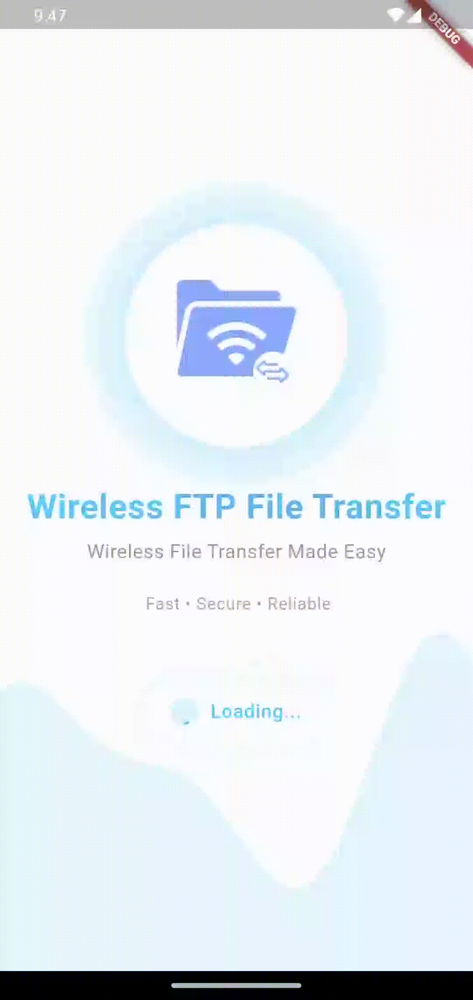
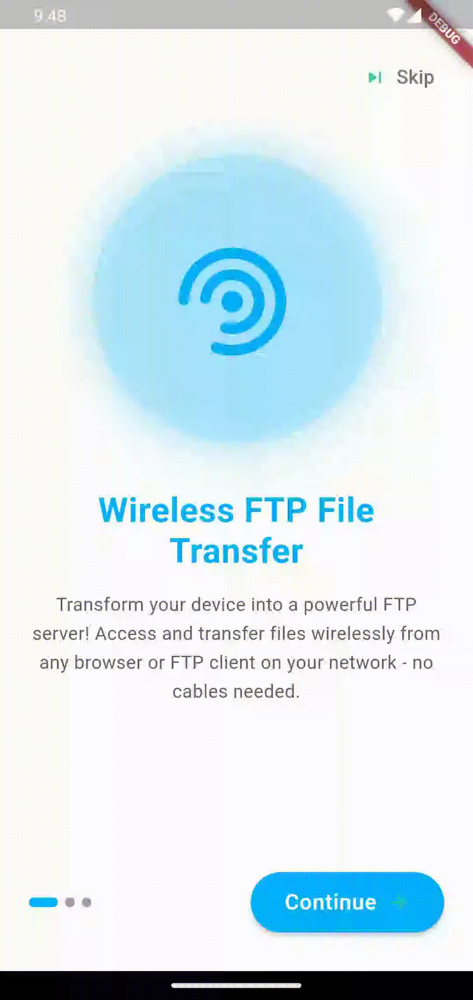
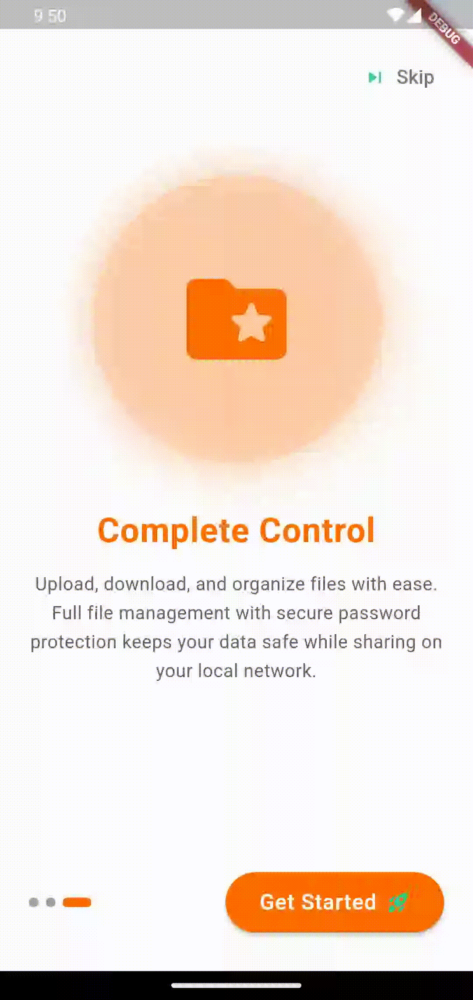

# 📂 Wireless FTP File Transfer App - Interactive Animations

> Experience seamless file sharing with our cutting-edge wireless FTP application featuring stunning animations and intuitive user interface design.

---

## 🎬 Application Animations Showcase

Discover the smooth, engaging animations that make file transfers effortless and enjoyable. Our app combines functionality with beautiful visual feedback to create an exceptional user experience.

---

## 🚀 Splash Screen
### *Dynamic Loading Experience*

Welcome users with an elegant splash screen that sets the tone for a premium file transfer experience. The loading animation provides visual feedback while the app initializes all necessary components.

#### ✨ Animation Features
- **🎯 Brand Introduction** - Smooth logo reveal with fade-in effects
- **⚡ Loading Indicators** - Progressive loading animation with visual feedback
- **🎨 Modern Design** - Clean, minimalist interface with elegant transitions
- **📱 Responsive Layout** - Optimized for all screen sizes and orientations

#### 🛠️ Technical Implementation
- Custom animation controllers with easing curves
- Optimized performance with efficient asset loading
- Seamless transition to onboarding flow
- Memory-efficient animation rendering

---

## 📚 Onboarding Screen
### *Interactive User Journey*

Guide new users through the app's powerful features with engaging onboarding animations that demonstrate key functionality and build user confidence.

#### ✨ Animation Features
- **📖 Feature Showcase** - Step-by-step introduction to core functionality
- **🎭 Interactive Elements** - Engaging micro-interactions and page transitions
- **🎯 User Guidance** - Clear visual cues directing user attention
- **📱 Swipe Gestures** - Smooth page transitions with parallax effects

#### 🛠️ Technical Implementation
- Page view controller with custom transition animations
- Gesture-driven navigation with spring physics
- Dynamic content loading with fade transitions
- Accessibility-compliant animation timing

---

## 🏠 Dashboard Screen
### *Command Center Experience*

Experience the heart of the application with a dynamic dashboard that provides real-time file transfer status, server management, and intuitive navigation controls.

#### ✨ Animation Features
- **📊 Real-Time Updates** - Live progress indicators and status animations
- **🔄 File Operations** - Smooth upload/download progress visualizations
- **🌐 Server Status** - Dynamic connection indicators with state transitions
- **📁 File Management** - Intuitive drag-and-drop animations and folder interactions

#### 🛠️ Technical Implementation
- Real-time data binding with animated state changes
- Custom progress indicators with smooth interpolation
- Background task animations with user feedback
- Optimized list animations for large file collections

---

## 🎨 Design Philosophy

### Animation Principles
- **🌟 Purposeful Motion** - Every animation serves a functional purpose
- **⚡ Performance First** - 60fps animations with efficient rendering
- **🎯 User-Centric** - Animations enhance usability without overwhelming
- **📱 Platform Native** - Following Material Design and iOS guidelines

### Technical Excellence
- **🔧 Optimized Performance** - GPU-accelerated animations with minimal CPU usage
- **🎛️ Configurable Settings** - User-controllable animation preferences
- **♿ Accessibility Support** - Respects system accessibility settings
- **🔋 Battery Efficient** - Smart animation scheduling to preserve battery life

---

## 🚀 Key Features Highlighted Through Animation

### File Transfer Capabilities
- **📤 Wireless Upload** - Drag-and-drop file uploads with progress visualization
- **📥 Smart Download** - Queue management with priority-based animations
- **🔄 Sync Operations** - Real-time synchronization with status indicators
- **📁 Folder Management** - Hierarchical navigation with smooth transitions

### Server Management
- **🌐 Auto-Discovery** - Network scanning with dynamic server detection
- **🔐 Secure Connections** - SSL/TLS setup with security status animations
- **⚙️ Configuration** - Settings panels with contextual help animations
- **📊 Monitoring** - Real-time performance metrics with chart animations

---

## 📱 Cross-Platform Excellence

### iOS Implementation
- **🍎 Native Feel** - iOS-specific animation curves and timing
- **🎨 Design Integration** - Seamless integration with iOS design language
- **📱 Device Optimization** - Tailored animations for different iPhone models

### Android Implementation
- **🤖 Material Design** - Following latest Material Design 3 principles
- **🎭 Custom Transitions** - Hero animations and shared element transitions
- **📐 Adaptive Layout** - Responsive animations for various screen densities

---

## 🔧 Animation Technical Stack

### Framework & Libraries
- **Flutter Animation Framework** - Leveraging Flutter's powerful animation system
- **Custom Animation Controllers** - Fine-tuned control over animation timing
- **Physics-Based Animations** - Natural spring and bounce effects
- **Lottie Integration** - Vector-based animations for scalable graphics

### Performance Optimization
- **🎯 Efficient Rendering** - Minimal overdraw with optimized widget trees
- **⚡ Smart Caching** - Animation frame caching for repeated sequences
- **🔋 Battery Awareness** - Adaptive animation quality based on battery level
- **📊 Performance Monitoring** - Real-time FPS monitoring and optimization

---

## 📞 Get Started

Ready to experience seamless wireless file transfers? Download the app and discover how animations can make file management both powerful and delightful.

**Key Benefits:**
- 🚀 **Fast Setup** - Get started in under 30 seconds
- 🔒 **Secure Transfer** - End-to-end encryption for all file operations
- 🌐 **Cross-Platform** - Works seamlessly across all devices
- 💡 **Intuitive Design** - Learn by using with guided animations

---

*Built with ❤️ using Flutter • Animations that bring functionality to life*