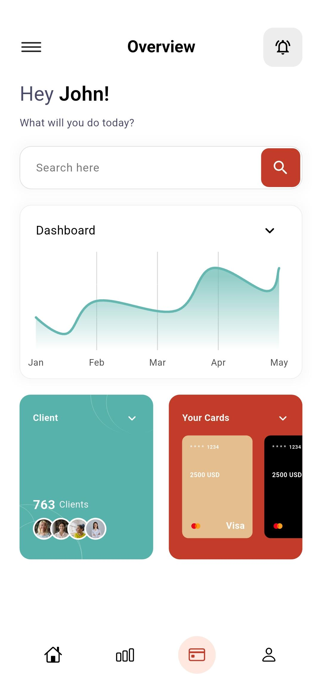
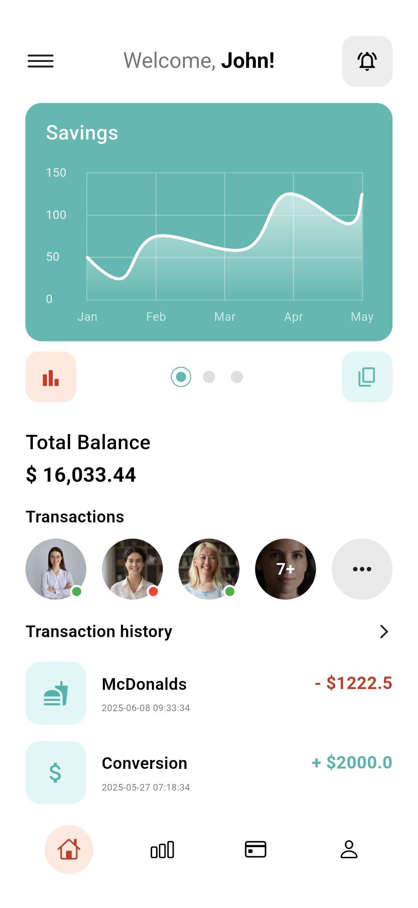

# 💰 Banking App Flutter UI

A modern and elegant banking mobile application UI built with Flutter, featuring beautiful design with comprehensive financial dashboard and analytics.

## 🚀 Features

**Modern UI**: Clean interface with gradient backgrounds and interactive charts<br>
**Dashboard Analytics**: Real-time balance tracking with visual performance indicators <br>
**Transaction Management**: Complete transaction history with contact-based transfers <br>
**Token System**: Bonus tokens, loyalty points, and rewards management <br>
**Card Management**: Multiple card support with secure payment integration <br>
**Client Portal**: Professional client management with visual statistics <br>
**Search Functionality**: Advanced search capabilities across all features

## 📱 Screenshots

### Savings Dashboard


*Interactive savings dashboard with monthly chart analytics, total balance display, and transaction history with contact integration*

### Main Dashboard


*Comprehensive dashboard featuring positions overview, cash management, token bonus system with circular progress indicators, and loyalty points tracking*

### Overview Screen


*Professional overview interface with advanced search functionality, performance analytics chart, client management system, and multiple card management features*

## 🛠️ Technical Stack

**Framework**: Flutter <br>
**Language**: Dart <br>
**UI**: Material Design with custom widgets <br>
**Charts**: Interactive financial charts and analytics <br>
**Navigation**: Flutter navigation system

## 📂 Project Structure

```
banking-app/
├── lib/
│   ├── main.dart           # App entry point
│   ├── Controller/         # Business logic controllers
│   ├── Core/              # Core utilities and constants
│   ├── Export/            # Export configurations
│   ├── Helper/            # Helper functions
│   ├── Model/             # Data models
│   ├── Services/          # API and external services
│   └── View/              # UI screens and widgets
│       ├── analysis_page.dart    # Analytics screens
│       ├── card_page.dart        # Card management
│       ├── home_page.dart        # Dashboard screens
│       └── main_page.dart        # Main navigation
├── android/               # Android-specific code
├── ios/                   # iOS-specific code
└── web/                   # Web support files
```

## 🚀 Getting Started

### Prerequisites
✔ Flutter SDK (latest stable version) <br>
✔ Dart SDK <br>
✔ Android Studio / VS Code

### Configuration
✔ Banking UI components setup <br>
✔ Chart visualization configuration <br>
✔ Navigation flow implementation <br>
✔ Theme and color scheme customization

## 🎨 Design Features

✔ Teal and orange gradient color schemes <br>
✔ Interactive charts with smooth animations <br>
✔ Card-based layout with rounded corners <br>
✔ Modern typography and icon integration <br>
✔ Responsive grid layouts for dashboard components <br>
✔ Circular progress indicators for token systems

## 🎯 Future Enhancements

✔ Dark mode theme implementation <br>
✔ Advanced animation transitions <br>
✔ Biometric authentication UI <br>
✔ Real-time notifications interface <br>
✔ Multi-language support

---