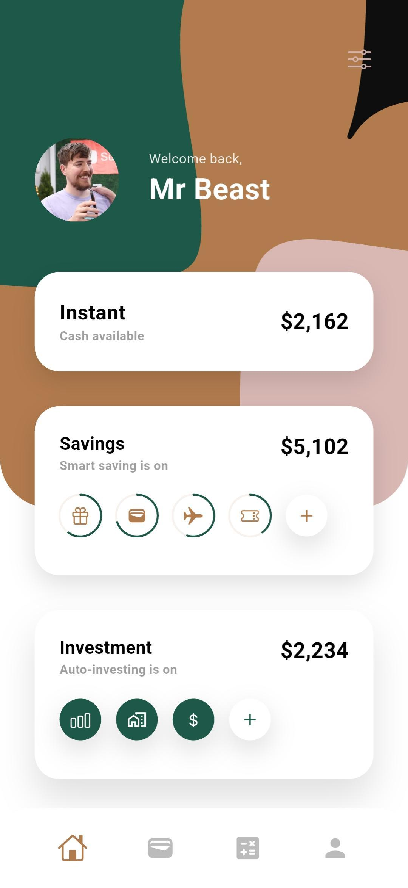
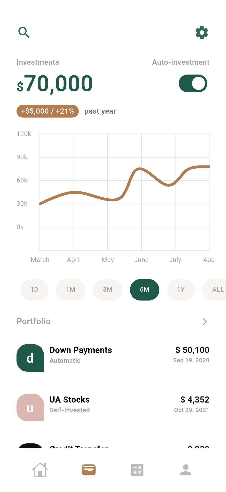
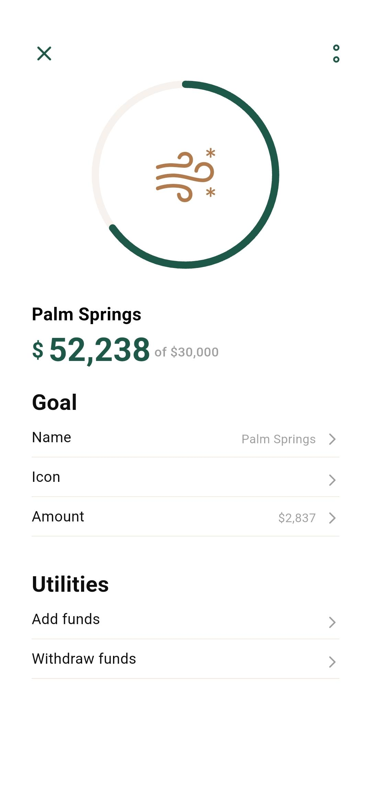
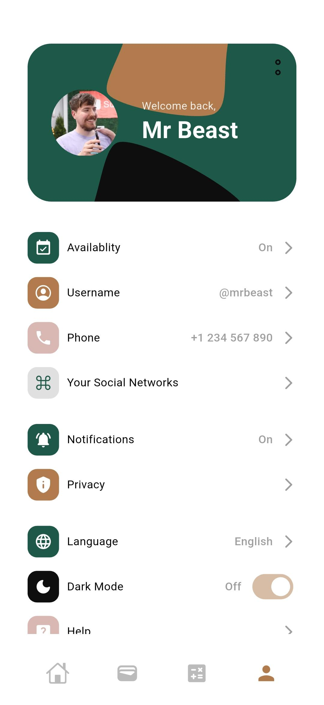

# 💳 Banking Store Flutter App

A modern and elegant banking mobile application built with Flutter, featuring beautiful UI design and comprehensive financial management system.

## 🚀 Features

**Modern UI**: Clean interface with gradient backgrounds and personalized user experience <br>
**Account Management**: Multiple account types (Instant Cash, Savings, Investment) <br>
**Investment Tracking**: Portfolio management with real-time charts and performance analytics <br>
**Smart Savings**: Automated saving features with category-based goal setting <br>
**Goal Planning**: Visual progress tracking for financial goals (e.g., Palm Springs trip) <br>
**User Profile**: Complete profile management with settings and preferences <br>

## 📱 Screenshots

### Dashboard Home


*Personalized welcome screen displaying multiple account types with real-time balance updates and intuitive category-based navigation icons*

### Investment Portfolio


*Comprehensive investment dashboard featuring portfolio performance analytics, interactive growth charts, and detailed investment breakdown with automatic tracking*

### Goal Details


*Smart goal management system with visual progress tracking, customizable goal settings, and integrated fund management utilities*

### User Profile


*Comprehensive user profile management with customizable settings, privacy controls, notification preferences, and personalization options*

## 🛠️ Technical Stack

➤ **Framework**: Flutter </br>
➤ **Language**: Dart </br>
➤ **UI**: Material Design with custom widgets </br>
➤ **Charts**: Interactive financial charts and graphs </br>
➤ **Navigation**: Flutter navigation system </br>

## 📂 Project Structure

```
banking-store/
├── lib/
│   ├── main.dart           # App entry point
│   ├── Controller/         # Business logic controllers
│   ├── Core/              # Core utilities and constants
│   ├── Model/             # Data models
│   ├── Services/          # API and external services
│   └── View/              # UI screens and widgets
│       ├── home/          # Dashboard screens
│       ├── tabs/          # Tab navigation
│       ├── landing/       # Landing pages
│       └── notification_page/ # Notification screens
├── android/               # Android-specific code
├── ios/                   # iOS-specific code
└── web/                   # Web support files
```

## 🚀 Getting Started

### Prerequisites
➤ Flutter SDK (latest stable version) </br>
➤ Dart SDK </br>
➤ Android Studio / VS Code </br>

### Configuration
➤ Banking API integration setup </br>
➤ Chart data visualization configuration </br>
➤ User authentication system </br>
➤ Financial data security protocols </br>

## 🎨 Design Features

➤ Green and orange gradient color scheme </br>
➤ Circular progress indicators for goals </br>
➤ Interactive charts and financial graphs </br>
➤ Modern card-based layout design </br>
➤ Smooth animations and transitions </br>

## 🎯 Future Enhancements

➤ Real-time transaction notifications </br>
➤ Advanced budget planning tools </br>
➤ Credit score monitoring </br>
➤ Bill payment automation </br>
➤ Multi-currency support </br>

---