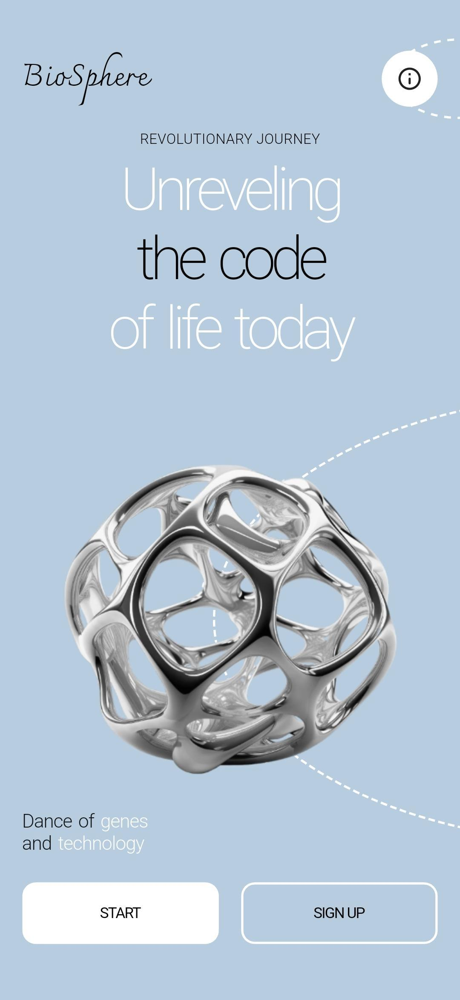
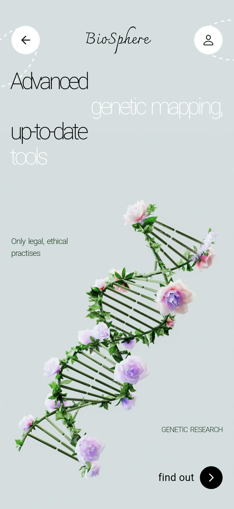
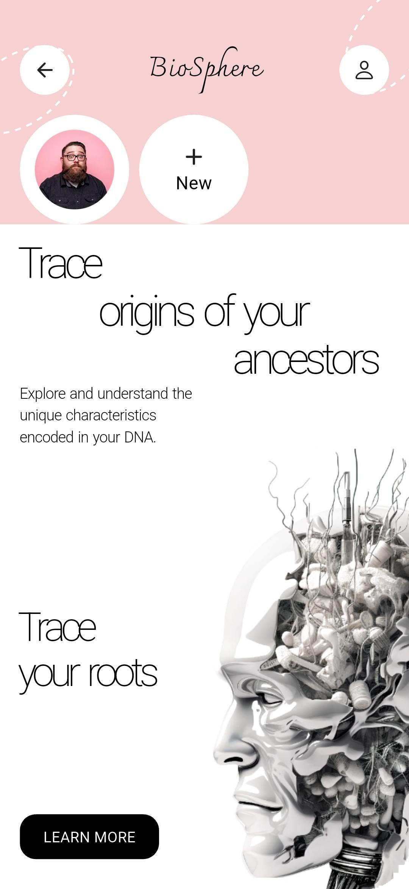

# 🧬 BioSphere Flutter App

A revolutionary genetic research and DNA analysis mobile application built with Flutter, featuring modern UI design and advanced genetic mapping tools.

## 🚀 Features

**Modern UI**: Clean interface with gradient backgrounds and elegant typography </br>
**Genetic Research**: Advanced genetic mapping and DNA analysis tools </br>
**User Journey**: Revolutionary journey to unveil the code of life </br>
**Ancestry Tracing**: Trace origins of ancestors and explore unique DNA characteristics </br>
**Ethical Practices**: Only legal and ethical genetic research practices </br>
**User Profiles**: Personalized experience with profile management </br>

## 📱 Screenshots

### Welcome Screen


*Main welcome screen featuring "Unreveling the code of life today" with 3D molecular structure and START/SIGN UP options*

### Genetic Mapping


*Advanced genetic mapping screen with DNA helix decorated with flowers, emphasizing ethical practices and up-to-date tools*

### Ancestry Tracing


*Trace origins screen with artistic DNA visualization, user profile integration, and "LEARN MORE" functionality*

## 🛠️ Technical Stack

🔬 **Framework**: Flutter </br>
🔬 **Language**: Dart </br>
🔬 **UI**: Material Design with custom widgets </br>
🔬 **Graphics**: 3D molecular visualizations </br>
🔬 **Navigation**: Flutter navigation system </br>

## 📂 Project Structure

```
biosphere-app/
├── lib/
│   ├── main.dart           # App entry point
│   ├── Controller/         # Business logic controllers
│   ├── Core/              # Core utilities and constants
│   ├── Model/             # Data models
│   ├── Services/          # API and external services
│   └── View/              # UI screens and widgets
├── android/               # Android-specific code
├── ios/                   # iOS-specific code
└── web/                   # Web support files
```

## 🚀 Getting Started

### Prerequisites
🔬 Flutter SDK (latest stable version) </br>
🔬 Dart SDK </br>
🔬 Android Studio / VS Code </br>

### Configuration
🔬 Genetic research API setup </br>
🔬 User authentication configuration </br>
🔬 Database integration for DNA data </br>
🔬 Privacy and security protocols </br>

## 🎨 Design Features

🔬 Gradient backgrounds with blue and pink themes </br>
🔬 3D molecular structure visualizations </br>
🔬 Artistic DNA helix with floral elements </br>
🔬 Modern typography and smooth animations </br>
🔬 Intuitive user interface design </br>

## 🎯 Future Enhancements

🔬 Advanced DNA sequencing tools </br>
🔬 Real-time genetic analysis </br>
🔬 Family tree visualization </br>
🔬 Health insights and recommendations </br>
🔬 Multi-language support for global reach </br>

---