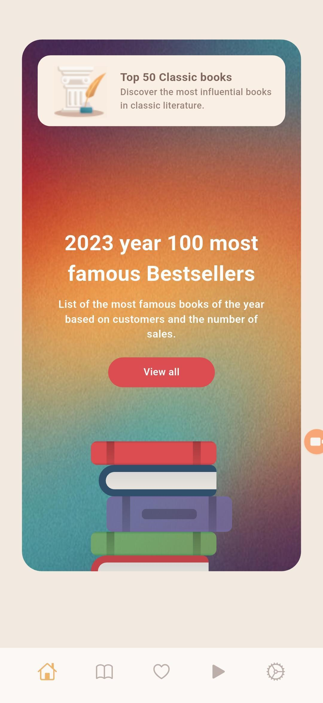
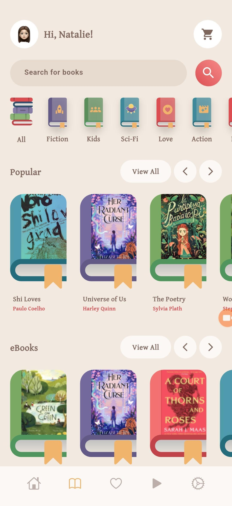
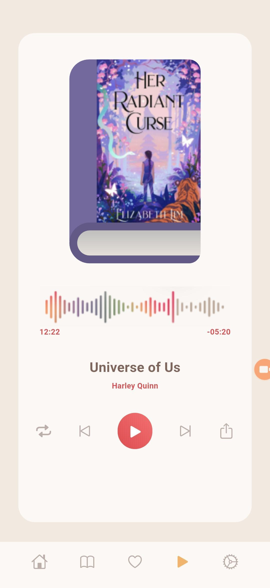
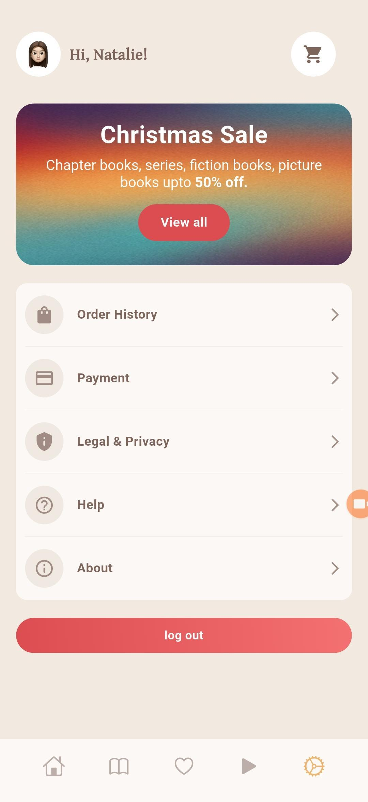

# 📚 Book Store Flutter App

A modern and elegant book store mobile application built with Flutter, featuring a beautiful UI design and comprehensive book management system.

## 🚀 Features

**Modern UI**: Clean interface with gradient backgrounds and personalized experience </br>
**Book Management**: Popular books, eBooks, category filtering, and bestsellers collection </br>
**Audio Player**: Built-in audiobook player with playback controls and progress tracking </br>
**Commerce**: Shopping cart, sales promotions, order history, and secure payments </br>
**User Account**: Authentication, profile settings, help & support </br>

## 📱 Screenshots

### Home Screen 📚 Featured Content </br>


### Home Screen 📚 Categories & Books </br>


### Audio Player


### User Profile & Settings


## 🛠️ Technical Stack

📚 **Framework**: Flutter </br>
📚 **Language**: Dart </br>
📚 **UI**: Material Design with custom widgets </br>
📚 **Audio**: Flutter audio plugins </br>
📚 **Navigation**: Flutter navigation system </br>

## 📂 Project Structure

```
book-store/
├── lib/
│   ├── main.dart           # App entry point
│   ├── Controller/         # Business logic controllers
│   ├── Core/              # Core utilities and constants
│   ├── Model/             # Data models
│   ├── Services/          # API and external services
│   └── View/              # UI screens and widgets
├── android/               # Android-specific code
├── ios/                   # iOS-specific code
└── web/                   # Web support files
```

## 🚀 Getting Started

### Prerequisites
📚 Flutter SDK (latest stable version) </br>
📚 Dart SDK </br>
📚 Android Studio / VS Code </br>

### Configuration
📚 API Setup for book data </br>
📚 Audio streaming configuration </br>
📚 Payment gateway integration </br>
📚 Firebase setup (optional) </br>

## 🎨 Design Features

📚 Gradient backgrounds and modern typography </br>
📚 Icon-based navigation and responsive design </br>
📚 Smooth animations and intuitive UI </br>

## 🎯 Future Enhancements

📚 Social sharing and book recommendations </br>
📚 Offline reading and multi-language support </br>
📚 Dark mode and reading progress tracking </br>