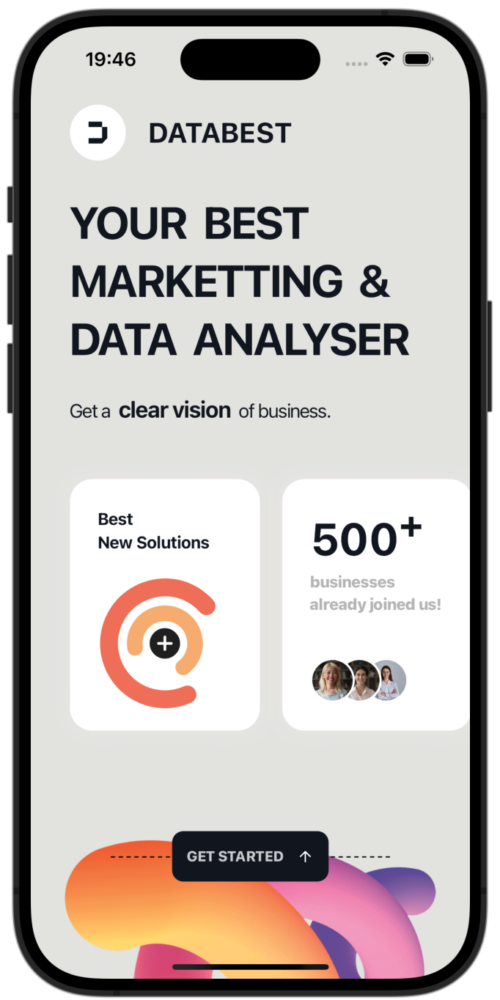
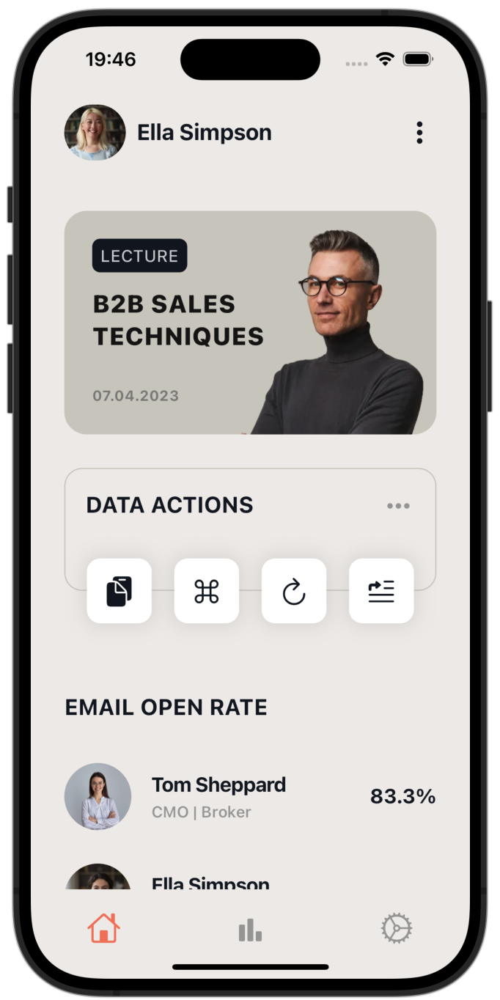
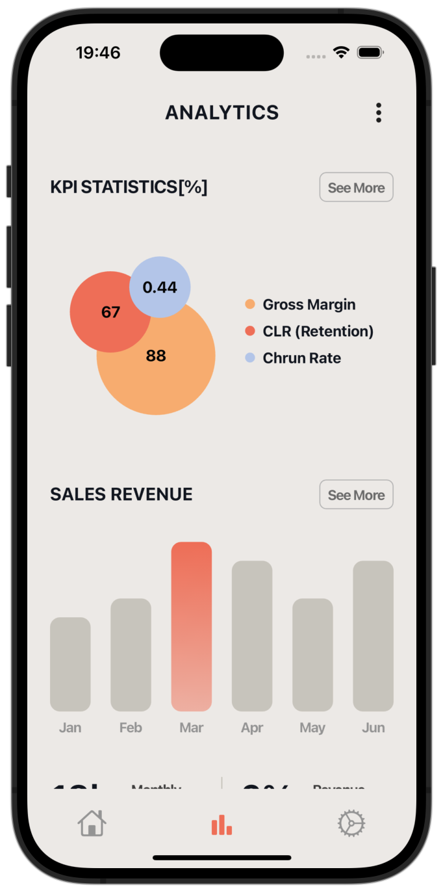

# 📊 DataBest Flutter App

A modern and professional marketing & data analysis mobile application built with Flutter, featuring comprehensive business analytics, KPI tracking, and sales performance monitoring.

## 🚀 Features </br>

📈 **Advanced Analytics**: Comprehensive KPI statistics with visual data representation </br>
💼 **Business Intelligence**: Marketing and data analysis tools for clear business vision </br>
📊 **Sales Tracking**: Revenue monitoring with detailed monthly performance charts </br>
👥 **Team Management**: Professional profiles and email campaign tracking </br>
🎯 **Performance Metrics**: CLR retention, churn rate, and gross margin analysis </br>
📱 **Modern UI**: Clean interface with professional business-focused design </br>
🎨 **Data Visualization**: Interactive charts, graphs, and statistical displays </br>

## 📱 Screenshots


### Welcome Screen


*Professional landing page featuring "Your Best Marketing & Data Analyser" with business statistics (500+ businesses joined), colorful gradient design, and call-to-action button*

### Dashboard Screen


*User dashboard for Ella Simpson showing B2B Sales Techniques lecture, data action tools, and email open rate metrics with professional team member profiles*

### Analytics Screen


*Comprehensive analytics dashboard with KPI statistics including pie charts for retention metrics, sales revenue bar charts, and monthly performance tracking*

## 🛠️ Technical Stack </br>

📊 **Framework**: Flutter </br>
📈 **Language**: Dart </br>
🎨 **UI**: Material Design with custom business-themed components </br>
📊 **Charts**: Advanced data visualization libraries </br>
💼 **Navigation**: Flutter navigation with bottom tab bar </br>

## 📂 Project Structure

```
databest/
├── lib/
│   ├── main.dart           # App entry point
│   ├── models/            # Data models
│   │   ├── profile_models.dart     # User profile models
│   │   └── revenue_model.dart      # Revenue data models
│   ├── pages/             # UI screens
│   │   ├── home_page.dart         # Main dashboard
│   │   └── landing_page.dart      # Welcome screen
│   ├── tabs/              # Tab navigation screens
│   └── utilities/         # Utility widgets and components
│       ├── best_new_solutions_widget.dart
│       ├── business_joined_count_widget.dart
│       ├── data_actions_widget.dart
│       ├── sales_revenue_chart_widget.dart
│       └── profile_title_widget.dart
├── android/               # Android-specific code
├── ios/                   # iOS-specific code
└── assets/               # Images and resources
```


### Configuration </br>
📊 Business analytics API integration </br>
📈 Chart and data visualization setup </br>
💼 User authentication and profile management </br>
🎨 Custom theme and branding configuration </br>

## 🎨 Design Features </br>

📊 Professional business color scheme (orange, coral, blue gradients) </br>
📈 Interactive charts and data visualization components </br>
💼 Modern card-based layout with clean typography </br>
🎯 Circular progress indicators and statistical displays </br>
📱 Responsive design with intuitive navigation </br>
🎨 Gradient backgrounds and modern UI elements </br>


## 🎯 Future Enhancements </br>

📊 Advanced machine learning analytics </br>
📈 Real-time data synchronization </br>
💼 Team collaboration features </br>
🔔 Smart notification system </br>
📱 Offline data analysis capabilities </br>
