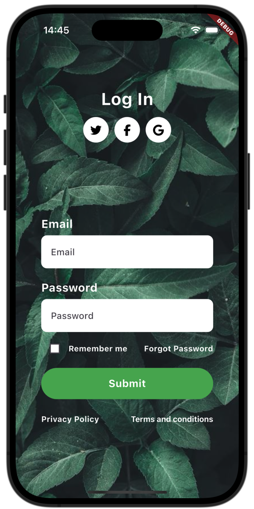
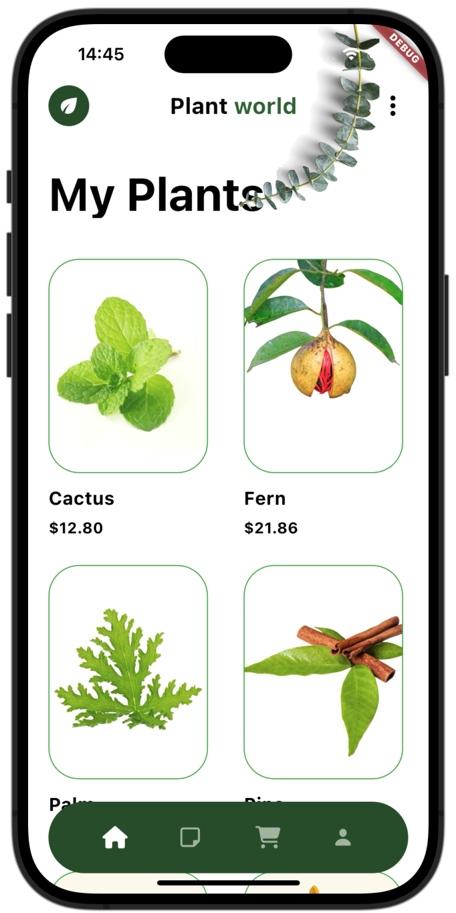

# 🌱 Plant World Flutter App

A modern and elegant plant store mobile application built with Flutter, featuring beautiful UI design and comprehensive plant catalog management system.

## 🚀 Features

🌿 **Modern UI**: Clean interface with natural green theme and elegant typography <br>
🛒 **Plant Catalog**: Comprehensive plant collection with detailed information and pricing <br>
🔐 **Social Authentication**: Multiple login options (Twitter, Facebook, Google) <br>
💰 **E-commerce Integration**: Product pricing and shopping cart functionality <br>
🌱 **Plant Categories**: Organized plant types (Cactus, Fern, Palm, Pine) <br>
📱 **Responsive Design**: Beautiful card-based layout with plant imagery <br>
🔒 **User Management**: Remember me functionality and password recovery <br>

## 📱 Screenshots

### Login Screen


*Beautiful nature-themed login interface with social media authentication options, email/password fields, and modern form design*

### Plant Catalog


*"My Plants" catalog featuring various plant types with high-quality imagery, pricing information, and organized grid layout*

## 📂 Project Structure

```
plant_world/
├── lib/
│   ├── main.dart           # App entry point
│   ├── Controller/         # Business logic controllers
│   ├── Core/              # Core utilities and constants
│   ├── Model/             # Data models
│   ├── Services/          # API and authentication services
│   └── View/              # UI screens and widgets
│       ├── auth/          # Authentication screens
│       ├── catalog/       # Plant catalog screens
│       └── widgets/       # Reusable UI components
├── android/               # Android-specific code
├── ios/                   # iOS-specific code
└── assets/               # Plant images and resources
```

## 🚀 Getting Started

### Prerequisites
🌱 Flutter SDK (latest stable version) </br>
🌿 Dart SDK </br>
🎨 Android Studio / VS Code </br>

### Configuration
🔐 Social media authentication setup (Twitter, Facebook, Google) </br>
🌱 Plant database integration </br>
💰 E-commerce payment gateway configuration </br>
🎨 Custom theme and plant imagery setup </br>

## 🎨 Design Features

🌿 Natural green color scheme with organic aesthetics </br>
🌱 High-quality plant photography and imagery </br>
🎨 Card-based layout with rounded corners and shadows </br>
📱 Modern typography and clean form design </br>
🔐 Intuitive social authentication buttons </br>
💚 Gradient backgrounds with nature-inspired themes </br>


## 🎯 Future Enhancements </br>

🌱 Plant care reminders and notifications </br>
📊 Growth tracking and plant health monitoring </br>
🌍 Augmented reality plant placement </br>
🛒 Advanced shopping cart and checkout flow </br>
📚 Plant care guides and educational content </br>

---
