# 🎨 Flutter UI Portfolio - Premium Mobile Applications

> A curated collection of modern Flutter applications showcasing cutting-edge design patterns, exceptional user experiences, and innovative technical implementations across diverse industry verticals.

---

## 📱 Project Overview

This portfolio demonstrates expertise in creating polished, production-ready Flutter applications with focus on:

✨ **Modern UI/UX Design** - Following latest design trends and Material Design principles  
✨ **Cross-Platform Excellence** - Optimized performance across iOS and Android  
✨ **Real-World Applications** - Practical solutions for various business domains  
✨ **Technical Innovation** - Advanced features and integrations  

---

## 🏦 Banking Application
### *Next-Generation Financial Dashboard*

Experience the future of mobile banking with our sophisticated financial management platform featuring real-time analytics, multi-account oversight, and intelligent transaction insights.

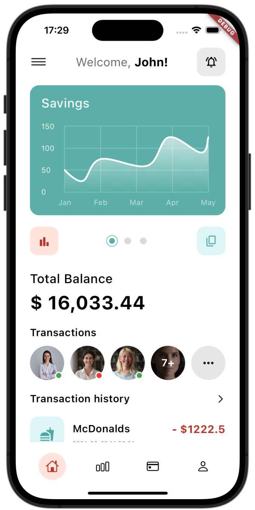 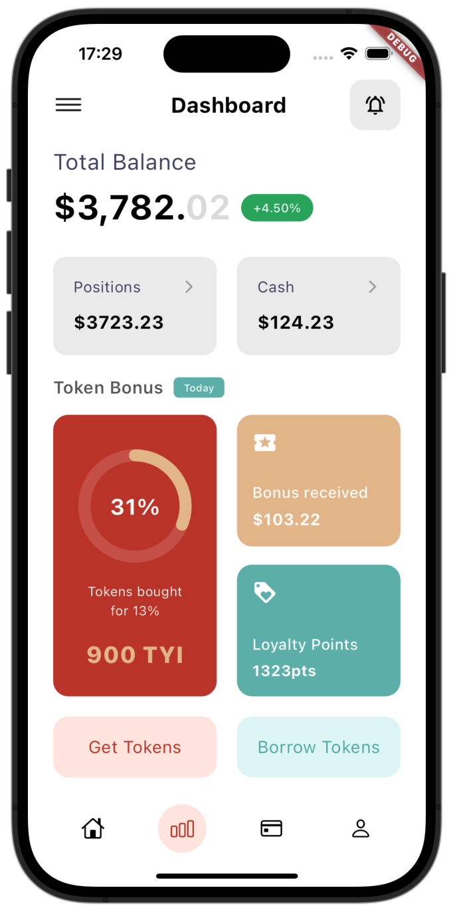 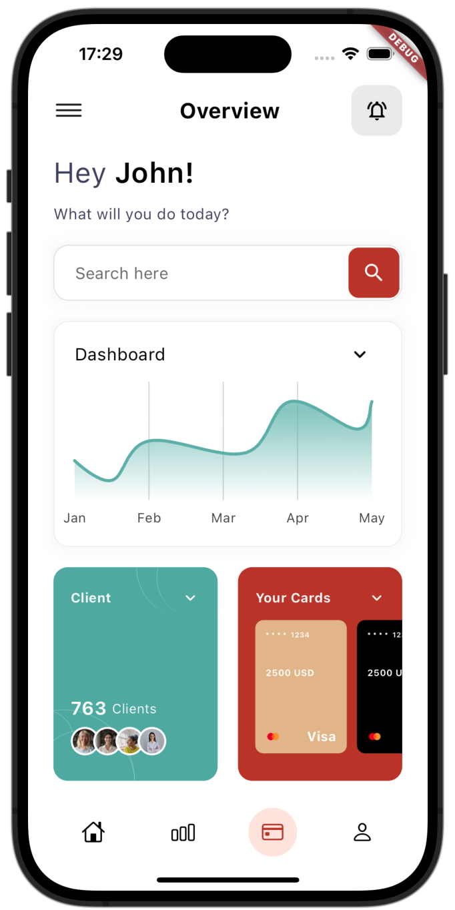

#### ✨ Key Features
- **📊 Advanced Analytics** - Real-time balance tracking with interactive charts and performance metrics
- **💳 Multi-Account Management** - Seamlessly manage checking, savings, and investment accounts
- **🎯 Loyalty Integration** - Token-based rewards system with points tracking
- **📈 Financial Insights** - AI-powered spending analysis and budget recommendations

#### 🛠️ Technical Highlights
- 🔹 Custom chart widgets with smooth animations
- 🔹 Biometric authentication integration
- 🔹 Real-time data synchronization
- 🔹 Responsive design for all screen sizes

---

## 💰 Banking Store
### *Comprehensive Wealth Management Platform*

Transform your financial future with our all-in-one wealth management solution, featuring sophisticated investment tracking, goal-oriented savings, and personalized financial planning tools.

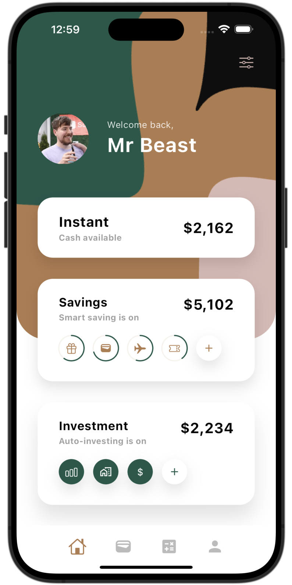 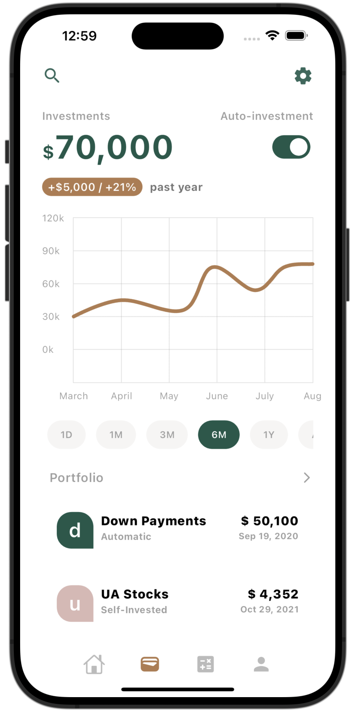 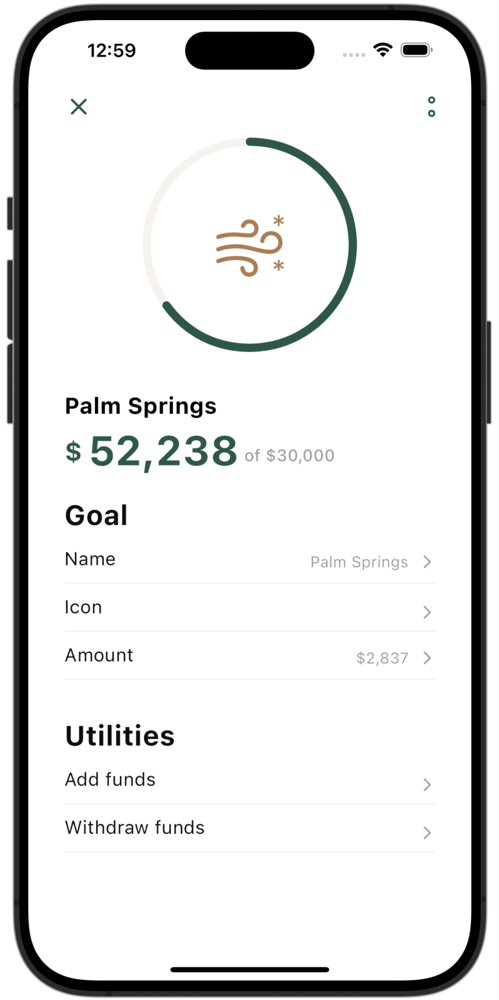 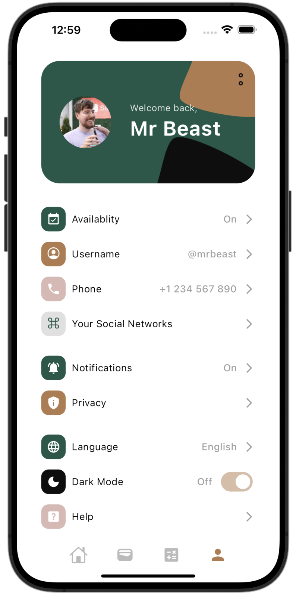

#### ✨ Key Features
- **💰 Smart Savings Engine** - Automated savings with intelligent round-up features
- **📊 Portfolio Management** - Real-time investment tracking with detailed performance analytics
- **🎯 Goal Visualization** - Interactive progress tracking with milestone celebrations
- **👤 Personal Finance Hub** - Comprehensive profile system with customizable preferences

#### 🛠️ Technical Highlights
- 🔸 Advanced state management with Provider/Riverpod
- 🔸 Custom data visualization components
- 🔸 Secure API integration with encryption
- 🔸 Offline-first architecture with sync capabilities

---

## 🧬 BioSphere App
### *Revolutionary Genetic Research Platform*

Unlock the mysteries of DNA with our cutting-edge genetic analysis platform, designed for researchers, enthusiasts, and anyone curious about their biological heritage.

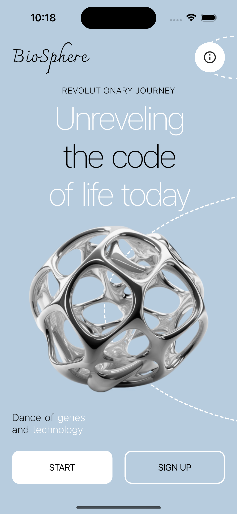 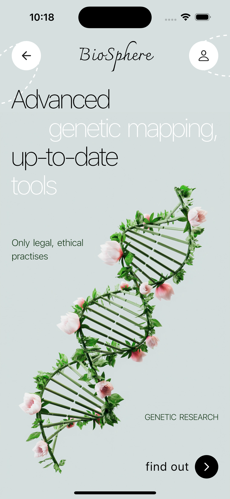 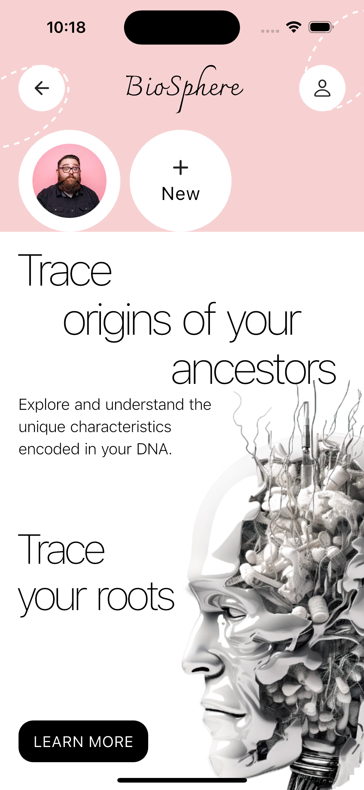

#### ✨ Key Features
- **🧬 Advanced Genomics** - Sophisticated genetic mapping with interactive 3D DNA visualization
- **🌱 Ancestry Intelligence** - Deep ancestral tracing with detailed family tree construction
- **🔬 Research Tools** - Professional-grade analysis tools for scientific research
- **🛡️ Privacy First** - End-to-end encryption with ethical data handling practices

#### 🛠️ Technical Highlights
- 🔶 Complex 3D visualizations using Flutter's custom painters
- 🔶 Integration with bioinformatics APIs
- 🔶 Advanced search and filtering algorithms
- 🔶 GDPR-compliant data management

---

## 📚 Book Store
### *Premium Digital Reading Experience*

Immerse yourself in literature with our modern bookstore app, combining traditional reading with cutting-edge audio technology for the ultimate literary experience.

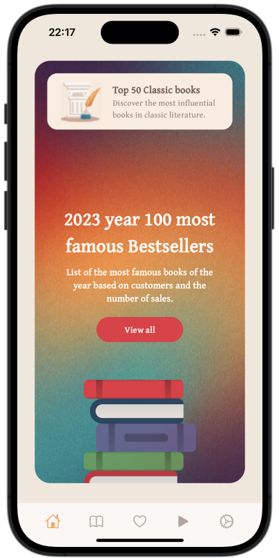 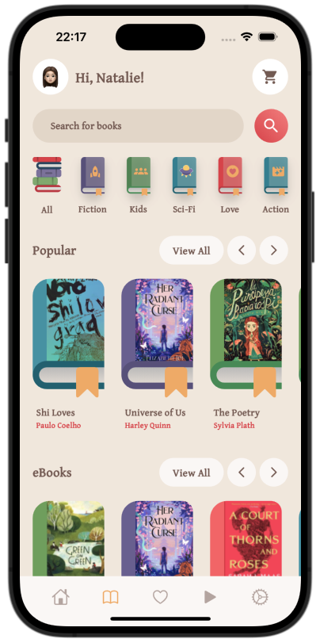 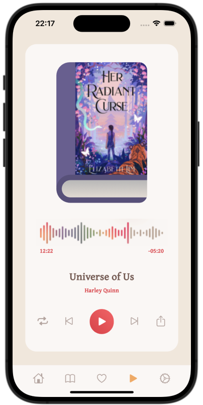 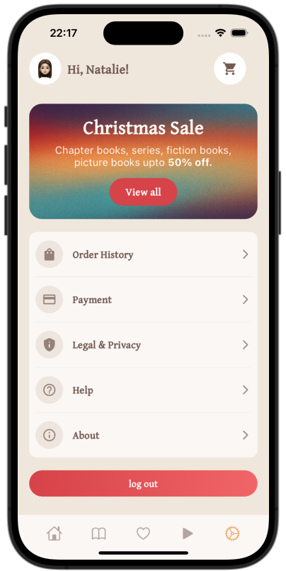

#### ✨ Key Features
- **📖 Vast Digital Library** - Extensive catalog with intelligent categorization and search
- **🎧 Premium Audio Experience** - High-quality audiobook player with speed control and bookmarks
- **🛒 Seamless Commerce** - Integrated shopping cart with secure payment processing
- **⭐ Personalized Recommendations** - AI-powered suggestions based on reading history

#### 🛠️ Technical Highlights
- ◆ Custom audio player with advanced controls
- ◆ E-commerce integration with payment gateways
- ◆ Recommendation engine implementation
- ◆ Offline reading capabilities with download management

---

## 📊 DataBest Analytics
### *Advanced Marketing & Data Analysis Platform*

Revolutionize your business intelligence with our comprehensive data analytics platform, designed to provide clear business insights through powerful visualization and intelligent analysis tools.

  

#### ✨ Key Features
- **📈 Advanced KPI Analytics** - Comprehensive statistics with interactive pie charts and performance metrics
- **💰 Revenue Tracking** - Monthly sales analysis with visual trend indicators
- **📚 Educational Platform** - Integrated lecture system with B2B sales techniques
- **👥 Business Community** - Connect with 500+ businesses for networking and insights

#### 🛠️ Technical Highlights
- 🔹 Interactive data visualization with custom chart components
- 🔹 Real-time analytics dashboard with KPI monitoring
- 🔹 Responsive design with gradient backgrounds and modern UI
- 🔹 Multi-section navigation with seamless user experience

---

## 🌱 Plant World
### *Premium Plant E-Commerce Experience*

Discover the beauty of nature with our elegant plant marketplace, featuring a curated collection of indoor and outdoor plants with seamless shopping and secure authentication.

 

#### ✨ Key Features
- **🛒 Plant Marketplace** - Curated collection with detailed plant information and pricing
- **🔐 Social Authentication** - Seamless login with Twitter, Facebook, and Google integration
- **📱 Personal Collection** - Track your plant purchases and build your digital garden
- **🎨 Nature-Inspired Design** - Beautiful botanical backgrounds with eco-friendly aesthetics

#### 🛠️ Technical Highlights
- 🔸 E-commerce functionality with shopping cart integration
- 🔸 Multi-platform social authentication (OAuth)
- 🔸 Custom plant catalog with detailed product cards
- 🔸 Immersive botanical UI with natural imagery backgrounds

---

## ✈️ Travel Explorer
### *Immersive Travel Discovery Platform*

Embark on extraordinary journeys with our stunning travel app, featuring breathtaking destinations, personalized recommendations, and seamless booking experiences for the modern explorer.

  

#### ✨ Key Features
- **🏛️ Destination Discovery** - Explore stunning locations like Cabo da Roca and Eira do Serrado with detailed information
- **⭐ Smart Recommendations** - AI-powered suggestions with ratings and reviews from fellow travelers
- **🎯 Activity Categories** - Curated experiences including hiking, sky tours, and cultural adventures
- **📱 Immersive Experience** - Full-screen destination imagery with interactive storytelling

#### 🛠️ Technical Highlights
- 🔹 Stunning full-screen image layouts with overlay text
- 🔹 Smooth page transitions and onboarding flow
- 🔹 Interactive rating system with user reviews
- 🔹 Category-based activity filtering and discovery

---

## 🔒 VPN Secure
### *Professional Privacy Protection*

Safeguard your digital presence with our enterprise-grade VPN solution, featuring military-level encryption and lightning-fast global connectivity.

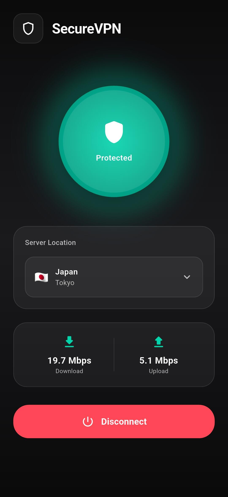 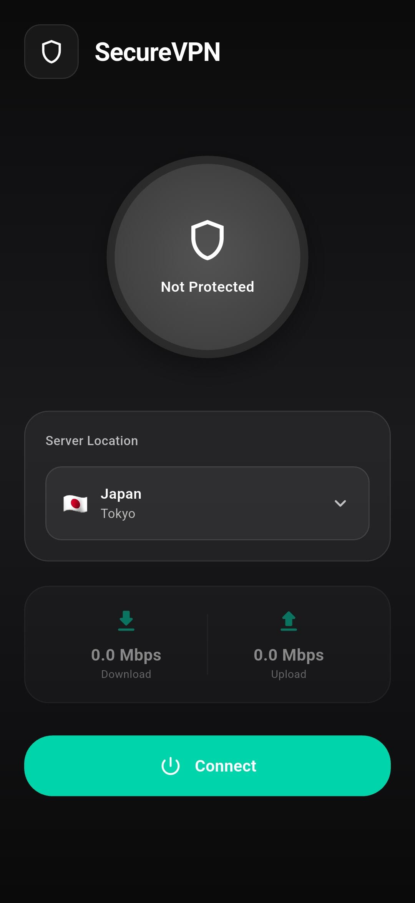

#### ✨ Key Features
- **🔒 Military-Grade Security** - WireGuard protocol with AES-256 encryption
- **🌍 Global Network** - Premium servers across 50+ countries with optimal routing
- **📊 Real-Time Monitoring** - Live speed tests, latency tracking, and connection analytics
- **🛡️ Advanced Protection** - Kill switch, DNS leak protection, and malware blocking

#### 🛠️ Technical Highlights
- 🔺 Native VPN protocol integration
- 🔺 Real-time network monitoring
- 🔺 Custom network speed testing
- 🔺 Platform-specific optimizations

---

## 🚀 Technical Excellence

### Development Standards
- **🎯 Clean Architecture** - SOLID principles with proper separation of concerns
- **🎯 State Management** - Advanced patterns using Provider, Bloc, or Riverpod
- **🎯 Testing** - Comprehensive unit, widget, and integration testing
- **🎯 Performance** - Optimized for 60fps with efficient memory management

### Design Philosophy
- **🌟 User-Centric** - Intuitive interfaces with accessibility in mind
- **🌟 Responsive** - Adaptive layouts for all screen sizes and orientations
- **🌟 Consistent** - Design system approach with reusable components
- **🌟 Modern** - Latest design trends with smooth animations and micro-interactions

---

## 📞 Let's Connect

Ready to bring your vision to life? Let's discuss how we can create exceptional mobile experiences together.

**Available for:**
- 📱 Custom Flutter Development
- 🎨 UI/UX Design Consultation
- 🔧 Code Review & Optimization
- 📚 Technical Mentoring

---

*Built with ❤️ by DevCodeSpace using Flutter • Showcasing innovation in mobile development*