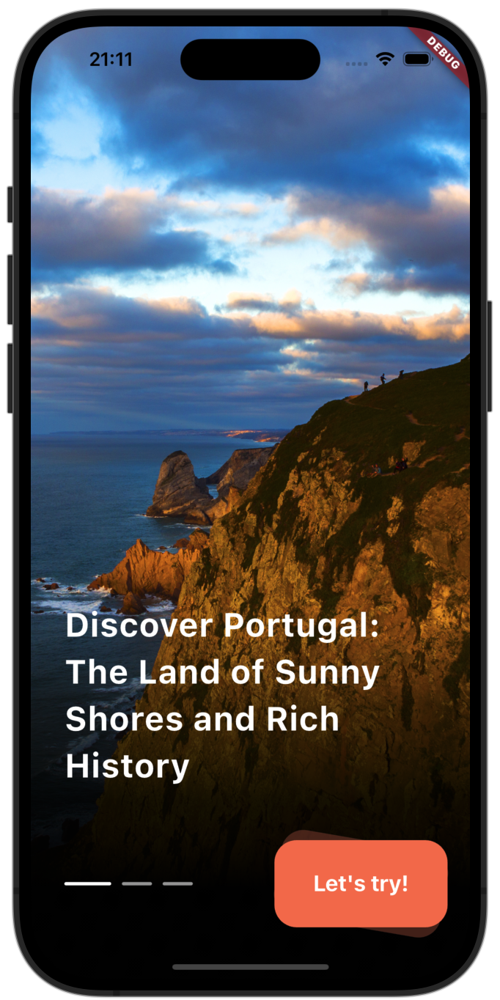
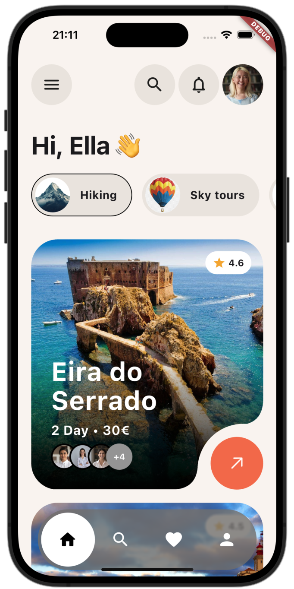
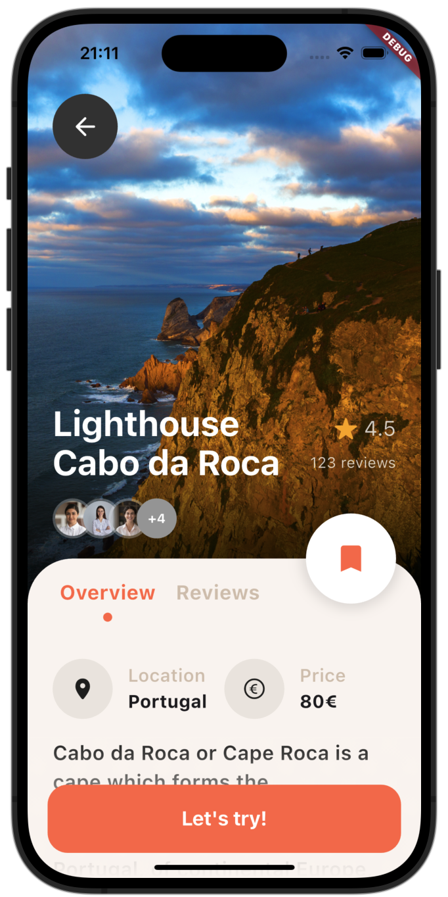

# ✈️ Travel App Flutter

A beautiful and modern travel mobile application built with Flutter, featuring stunning destination discovery, tour booking, and comprehensive travel planning capabilities.

## 🚀 Features</br>

🌍 **Destination Discovery**: Explore beautiful locations like Portugal's coastline and historical sites </br>
🏛️ **Tour Packages**: Curated travel experiences with detailed pricing and duration information </br>
⭐ **Rating System**: User reviews and ratings for destinations and experiences </br>
👥 **Social Features**: View traveler profiles and group bookings with participant count </br>
📱 **Modern UI**: Stunning visual design with scenic landscape photography </br>
🎯 **Activity Categories**: Hiking, sky tours, and various adventure activities </br>
💰 **Pricing Transparency**: Clear pricing information with multi-day package options </br>

## 📱 Screenshots

### Welcome Screen


*Stunning onboarding screen featuring "Discover Portugal: The Land of Sunny Shores and Rich History" with breathtaking coastal cliff imagery and call-to-action button*

### Home Dashboard


*Personalized dashboard for Ella with activity categories (Hiking, Sky tours), featured destination "Eira do Serrado" with 4.6 rating, 2-day package for 30€, and participant preview*

### Destination Details


*Detailed view of "Lighthouse Cabo da Roca" with 4.5 rating, 123 reviews, participant count, location information (Portugal), pricing (80€), and comprehensive description*


## 📂 Project Structure

```
travel/
├── lib/
│   ├── main.dart           # App entry point
│   ├── model/             # Data models
│   │   └── activity_model.dart    # Activity and destination models
│   ├── pages/             # UI screens
│   │   ├── landing_page.dart              # Welcome/onboarding screen
│   │   ├── listing_page.dart              # Destination listings
│   │   └── travel_destination_details_page.dart  # Detail views
│   ├── utils/             # Utility functions
│   │   └── colors.dart    # App color scheme
│   └── widgets/           # Reusable UI components
│       ├── activity_tile_list_view_widget.dart
│       ├── bottom_navigation_bar.dart
│       ├── listing_header_widget.dart
│       └── s_custom_painter.dart
├── assets/               # Travel images and resources
├── android/             # Android-specific code
└── ios/                 # iOS-specific code
```


### Configuration</br>
🗺️ Travel API integration for destinations and bookings </br>
📸 Image asset management for destination photography </br>
⭐ Review and rating system setup </br>
💰 Payment gateway integration for tour bookings </br>

## 🎨 Design Features</br>

🌊 Ocean and landscape-inspired color schemes with natural tones </br>
📸 Full-screen destination photography with overlay text </br>
🎯 Circular profile avatars and participant count displays </br>
⭐ Star rating system with review count integration </br>
🏷️ Pricing tags and duration indicators </br>
🌅 Gradient overlays and scenic background imagery </br>


## 🎯 Future Enhancements</br>

🗺️ Interactive maps with destination markers </br>
📅 Travel itinerary planning and calendar integration </br>
🎫 Digital ticket management and QR codes </br>
🌤️ Weather information for destinations </br>
📱 Offline mode for travel guides and maps </br>
