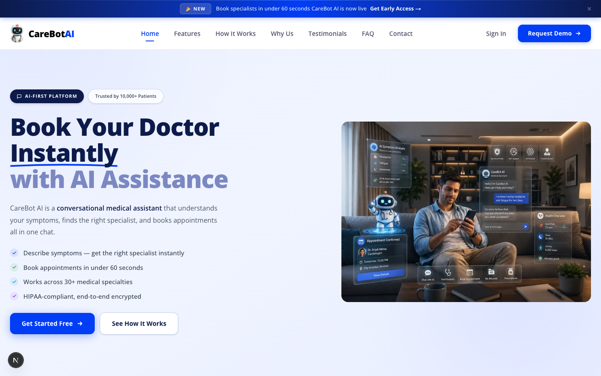
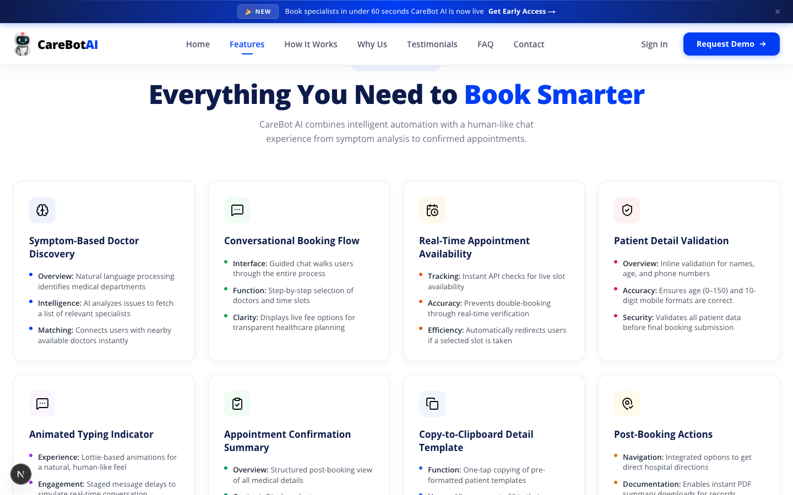

# CareBot AI

> AI-powered healthcare appointment booking — describe your symptoms, get matched to the right specialist, and confirm a booking in under 60 seconds.

CareBot AI is a **conversational medical assistant** that understands your symptoms in plain language, identifies the right specialist, checks live appointment availability, and walks you through booking — all inside a single chat interface. No phone queues. No forms. No account required.

---

## Preview

### Hero



### Features



---

## Features

| Feature | Description |
|---|---|
| **Symptom-Based Doctor Discovery** | NLP maps your plain-language description to the right medical specialty and nearby available doctors |
| **Conversational Booking Flow** | Guided chat walks you step-by-step through slot selection, fee review, and patient details |
| **Real-Time Availability** | Live API checks prevent double-bookings and auto-redirect if a slot is taken |
| **Patient Detail Validation** | Inline validation for name, age (0–150), and 10-digit phone — errors caught before submission |
| **Animated Typing Indicator** | Staged message delays and bounce animations for a natural, human-like chat experience |
| **Appointment Confirmation Summary** | Post-booking view with doctor, hospital, time, fees, and patient contact |
| **Copy-to-Clipboard Template** | One-tap copy of a pre-formatted patient detail template |
| **Post-Booking Actions** | PDF summary download, hospital directions link, and clean next-step transitions |

---

## Tech Stack

| Technology | Version |
|---|---|
| [Next.js](https://nextjs.org) | 16.2.6 |
| [React](https://react.dev) | 19.2.4 |
| [Tailwind CSS](https://tailwindcss.com) | 4.x |
| [TypeScript](https://www.typescriptlang.org) | 5.x |
| ESLint | 9.x |

**Font:** Open Sans (Google Fonts) — weights 400, 500, 600, 700, 800

---

## Getting Started

### Prerequisites

- Node.js 18+
- npm or yarn

### Installation

```bash
git clone https://github.com/DevCodeSpace/CareBot_AI.git
cd CareBot_AI
npm install
npm run dev
```

Open [http://localhost:3000](http://localhost:3000) in your browser.

### Scripts

```bash
npm run dev      # Start development server
npm run build    # Build for production
npm run start    # Start production server
npm run lint     # Run ESLint
```

---

## Project Structure

```
carebot-ai/
├── src/
│   ├── app/
│   │   ├── layout.tsx        # Root layout — font, metadata, body wrapper
│   │   ├── page.tsx          # Page composition — all sections in order
│   │   └── globals.css       # Global styles, CSS variables, keyframe animations
│   └── components/
│       ├── AnnouncementTicker.tsx   # Scrolling top banner
│       ├── LayoutShell.tsx          # Wraps Navbar + Hero
│       ├── Navbar.tsx               # Fixed nav with scroll-spy active links (client)
│       ├── Hero.tsx                 # Hero section with headline + illustration
│       ├── ChatMockup.tsx           # Animated chat UI preview
│       ├── Features.tsx             # 8-feature card grid
│       ├── HowItWorks.tsx           # 4-step process cards
│       ├── WhyUs.tsx                # Stats bar + 6 reason cards
│       ├── Testimonials.tsx         # 6 patient review cards
│       ├── FAQ.tsx                  # Categorised accordion FAQ (client)
│       ├── Contact.tsx              # Contact form with validation (client)
│       └── Footer.tsx               # Brand column + nav links + CTA band
└── public/
    ├── carebot_logo.svg       # Brand logo (Navbar + Footer)
    ├── illustration.png       # Hero illustration
    └── *.svg                  # Section-specific icons
```

### Page Section Order

```
AnnouncementTicker → Navbar → Hero → Features → HowItWorks
→ WhyUs → Testimonials → FAQ → Contact → Footer
```

### Client vs Server Components

| Component | Type | Reason |
|---|---|---|
| `Navbar.tsx` | Client | `useState`, scroll listener, `IntersectionObserver` |
| `FAQ.tsx` | Client | `useState` for accordion open/close and active category |
| `Contact.tsx` | Client | `useState` for form fields, loading, and submit state |
| All others | Server | No browser APIs or React state |

---

## Design System

### Brand Colors

| Token | Hex | Usage |
|---|---|---|
| Primary Blue | `#003DF5` | Buttons, links, accents, badges |
| Secondary Blue | `#0096DE` | Gradients, stats, hover |
| Dark Navy | `#0D1B4B` | Headings, footer background |
| Site Background | `#F6F6F7` | Body, Why Us, FAQ sections |

### Key Stats (from the platform)

- **10,000+** patients served
- **30+** medical specialties covered
- **< 60 seconds** average booking time
- **98%** patient satisfaction rate
- **4.9 / 5** rating from 2,400+ reviews

### Animations

| Class | Effect | Usage |
|---|---|---|
| `animate-ticker` | Infinite horizontal scroll | Announcement ticker |
| `float-animation` | Gentle vertical float | Chat mockup card |
| `fade-in-up` | Opacity + translate reveal | Section entry animations |
| `typing-dot` | Bounce + opacity | Chat typing indicator |
| `pulse-dot` | Glow pulse | Hero live indicator |

---

## Deployment

The project is ready to deploy on [Vercel](https://vercel.com):

```bash
npm run build
```

Or connect the GitHub repository to Vercel for automatic deployments on push.

---

## License

MIT License — free to use, modify, and distribute.

---

<p align="center">Built with Next.js · Tailwind CSS · React 19</p>
