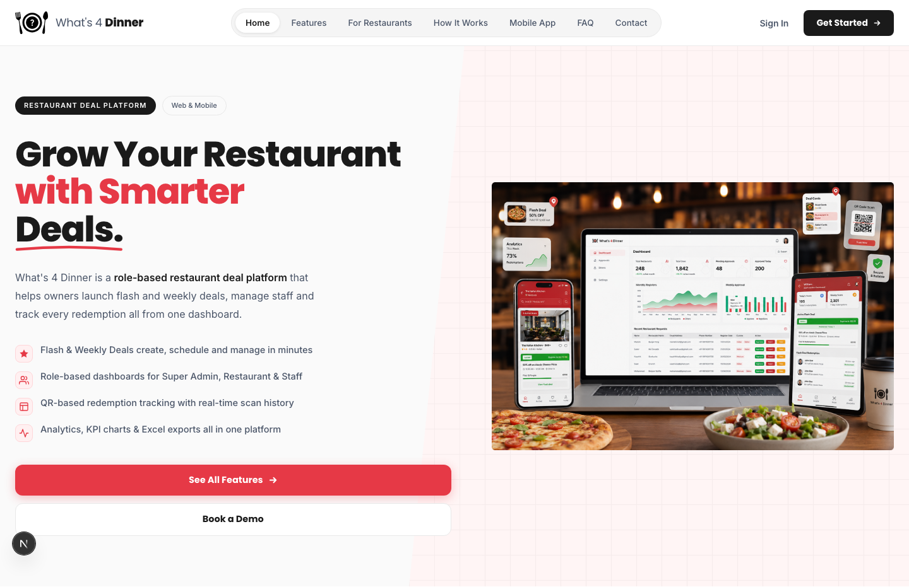
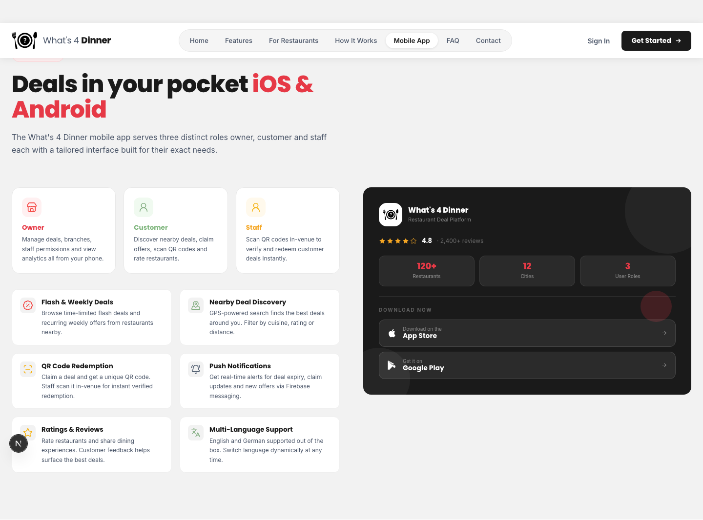

# Next.js Web Portfolio — Premium Landing Pages & Platforms

A curated collection of production-grade Next.js applications showcasing modern UI/UX, full-stack engineering, and real-world product platforms across healthcare, logistics, beauty tech, and hospitality.

---

## Table of Contents

- [Overview](#project-overview)
- [Projects](#projects)
  - [CareBot AI](#carebot-ai)
  - [TransportPro](#transportpro)
  - [TrueGlow AI](#trueglow-ai)
  - [What's 4 Dinner](#whats-4-dinner)
- [Technical Standards](#technical-excellence)
- [Contact](#lets-connect)

---

## Project Overview

This portfolio demonstrates expertise in building fast, accessible, production-ready Next.js applications, with a focus on:

- **Modern UI/UX Design** — Clean, conversion-focused interfaces with smooth animations
- **Full-Stack Engineering** — API routes, form handling, email delivery, and validation
- **SEO & Performance** — Schema.org, sitemaps, Core Web Vitals, and image optimization
- **Real-World Platforms** — Practical solutions across healthcare, logistics, beauty tech, and hospitality

---

## Projects

### CareBot AI
**Conversational Healthcare Appointment Booking**

🔗 [Live Demo](https://carebot-ai-landing-page.vercel.app/)

An AI-powered medical assistant that understands symptoms in plain language, identifies the right specialist, checks live appointment availability, and guides patients through the booking process — entirely within a single chat interface.

 

**Key Features**
- Symptom-based doctor discovery — NLP maps plain-language symptoms to the right specialty and nearby available doctors
- Conversational booking flow — guided chat through slot selection, fee review, and patient details
- Real-time availability — live API checks prevent double-bookings with auto-redirect on conflicts
- Patient detail validation — inline validation for name, age, and phone before submission

**Tech Stack:** Next.js 16 · React 19 · Tailwind CSS 4 · TypeScript

**Highlights**
- Animated typing indicator with staged message delays
- Post-booking PDF summary download and directions link
- Copy-to-clipboard patient detail template

---

### TransportPro
**India's All-in-One Transport & Logistics Management Platform**

🔗 [Live Demo](https://transportationnextjs.vercel.app/)

A high-performance marketing platform for a transport management system built for Indian logistics businesses, covering shipment loading, GST-ready invoicing, freight billing, and real-time stock dashboards.

**Key Features**
- 11 core platform modules — shipment loading, delivery workflow, freight calculation, and admin control
- 100% GST compliant — every invoice and report is tax-ready by default
- Taka & Bale management — native textile shipment tracking
- 8+ logistics reports — pending delivery, invoice, freight, commission, and stock summation

**Tech Stack:** Next.js 16 · React 19 · Tailwind CSS 4 · Framer Motion

**Highlights**
- Server-side validated contact API with Nodemailer email delivery
- Full SEO stack — Schema.org JSON-LD, sitemap, robots.txt, PWA manifest
- Google Analytics integration with zero render-blocking load strategy

---

### TrueGlow AI
**AI-Powered Skincare Companion**

🔗 [Live Demo](https://true-glow-ai-landing-page.vercel.app/)

A responsive landing page for an AI skincare app featuring face scanning, AI consultation, detailed reports, scan history, and secure authentication — presented as a polished, product-style website.

 

**Key Features**
- AI skin analysis — strong hero, stats, and product CTAs around face scanning
- AI chat & reports — detailed scan results with text-to-speech and scan history
- Mobile app showcase — app store buttons with an in-page phone mockup
- Secure authentication — Firebase-style auth flow and profile management

**Tech Stack:** Next.js 16 · React 19 · Tailwind CSS 4 · TypeScript

**Highlights**
- Category-based interactive FAQ accordion
- Responsive navigation with desktop links and mobile drawer
- Contact form with loading and submitted states

---

### What's 4 Dinner
**Role-Based Restaurant Deal Platform**

🔗 [Live Demo](https://whats4dinnerapp.com/)

A marketing landing page for a platform that helps restaurant owners launch flash and weekly deals, manage staff, and track redemptions — while customers discover and claim nearby deals via QR-code redemption.

 

**Key Features**
- Flash & weekly deals — create, schedule, and manage time-limited or recurring offers
- QR code redemption — every claimed deal generates a unique, trackable in-venue QR code
- Role-based dashboards — purpose-built views for Super Admin, Restaurant Admin, and Staff
- Analytics & Excel export — KPI charts plus downloadable dashboard and redemption data

**Tech Stack:** Next.js 16 (App Router, static export) · React 19 · Tailwind CSS 4

**Highlights**
- Deployed on Firebase Hosting
- Multi-role mobile app (iOS & Android) with push notifications and multi-language support
- Poppins & Inter typography via `next/font/google`

---

## Technical Excellence

**Development Standards**
- Clean architecture — clear separation between sections, components, and data layers
- Type safety — end-to-end TypeScript across every project
- Validation — server-side form validation with field-level error handling
- Performance — optimized images, font loading, and zero render-blocking scripts

**Design Philosophy**
- User-centric — conversion-focused layouts with accessibility in mind
- Responsive — mobile-first design across every breakpoint
- Consistent — reusable section components and shared design tokens
- Modern — smooth animations and micro-interactions throughout

---

## Let's Connect

Ready to bring your vision to life? Let's discuss how we can create exceptional web experiences together.

**Available for:**
- 🌐 Custom Next.js Development
- 🎨 UI/UX Design Consultation
- 🔧 Code Review & Optimization
- 📈 Technical Mentoring

---

*Built by DevCodeSpace using Next.js.*
