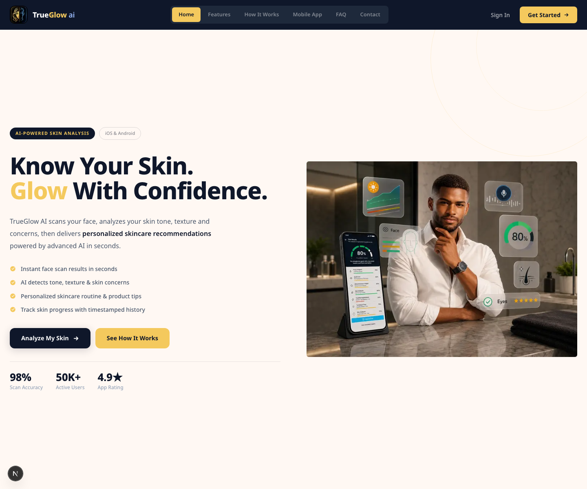
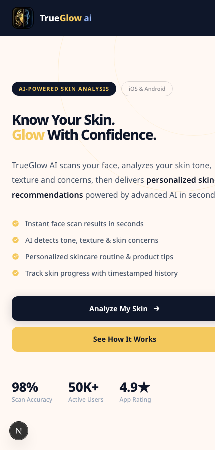

# TrueGlow AI

TrueGlow AI is a responsive landing page for an AI-powered skincare mobile app. It presents skin scanning, AI consultation, detailed reports, scan history, secure authentication, text-to-speech, and contact flows in a polished product-style website.



## App Preview

| Desktop | Mobile |
| --- | --- |
|  |  |

## Features

- AI skin analysis landing page with a strong hero, stats, and product CTAs.
- Responsive navigation with desktop links and a mobile drawer menu.
- Feature grid covering face scanning, detailed results, AI chat, scan history, text-to-speech, profile management, and Firebase-style authentication.
- Step-by-step "How It Works" timeline for the skincare analysis flow.
- Mobile app showcase with app store buttons and an in-page phone mockup.
- Interactive FAQ categories and accordions.
- Contact form with loading and submitted states.
- Branded footer with product, support, legal, and social links.

## Tech Stack

- Next.js 16.2.6
- React 19.2.4
- TypeScript
- Tailwind CSS 4
- ESLint 9

## Getting Started

Install dependencies:

```bash
npm install
```

Run the development server:

```bash
npm run dev
```

Open [http://localhost:3000](http://localhost:3000) in your browser.

## Available Scripts

```bash
npm run dev
```

Starts the local Next.js development server.

```bash
npm run build
```

Creates a production build.

```bash
npm run start
```

Runs the production build.

```bash
npm run lint
```

Runs ESLint for code quality checks.

## Project Structure

```text
.
├── docs/images/          # README screenshots
├── public/               # App logos, illustrations, and SVG icons
├── src/app/              # Next.js app entry, metadata, and global styles
├── src/components/       # Landing page sections and UI components
├── next.config.ts
├── package.json
└── tsconfig.json
```

## Main Sections

- `Navbar` - fixed responsive navigation and mobile drawer.
- `Hero` - app positioning, CTAs, stats, and skin analysis visual.
- `Features` - complete product feature grid.
- `HowItWorks` - five-step analysis timeline.
- `MobileApp` - mobile app benefits, store buttons, and phone UI mockup.
- `FAQ` - category-based interactive FAQ.
- `Contact` - contact form and trust/support content.
- `Footer` - final CTA, navigation links, and social links.

## Assets

The app uses local assets from `public/`, including:

- `logo.jpeg`
- `Illustration.png`
- SVG feature icons for AI skin analysis, chat, scan history, upload, security, user profile, and text-to-speech.

The README screenshots are stored in `docs/images/` so they display correctly on GitHub.

## Deployment

The easiest deployment target is Vercel:

1. Push this repository to GitHub.
2. Import the repository in Vercel.
3. Keep the default Next.js settings.
4. Deploy.

You can also deploy anywhere that supports Node.js and Next.js production builds.
