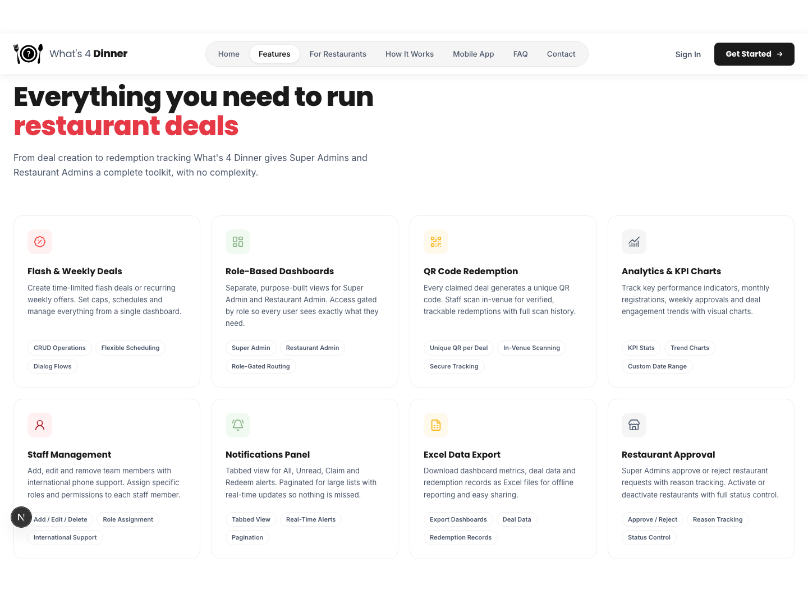
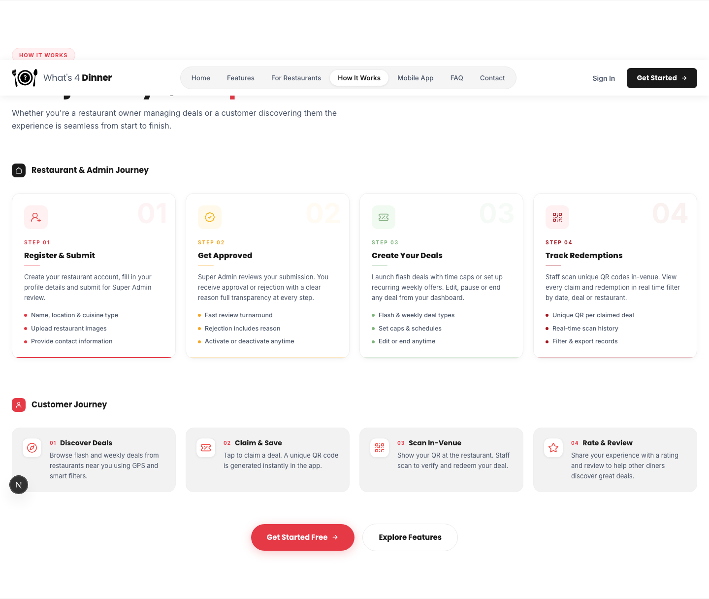

# What's 4 Dinner — Landing Page

The marketing/landing site for **What's 4 Dinner**, a role-based restaurant deal platform that helps restaurant owners launch flash and weekly deals, manage staff, and track redemptions — while customers discover and claim nearby deals through QR-code redemption.

Built with [Next.js](https://nextjs.org) (App Router, static export), React 19, and Tailwind CSS 4.

## Preview


## Features

This landing page showcases the core capabilities of the What's 4 Dinner platform:

- **Flash & Weekly Deals** — create, schedule and manage time-limited or recurring offers
- **Role-Based Dashboards** — separate, purpose-built views for Super Admin and Restaurant Admin
- **QR Code Redemption** — every claimed deal generates a unique QR code, scanned in-venue for verified, trackable redemptions
- **Analytics & KPI Charts** — track registrations, approvals, and deal engagement trends
- **Staff Management** — add, edit and remove team members with role and permission control
- **Notifications Panel** — tabbed, paginated alerts for claims, redemptions and updates
- **Excel Data Export** — download dashboard metrics, deal data and redemption records
- **Restaurant Approval** — Super Admins approve/reject restaurant requests with reason tracking

<p align="center">
  
</p>

### How It Works

Two journeys, one platform — a guided flow for restaurant owners (register → get approved → create deals → track redemptions) and for customers (discover → claim → scan in-venue → rate & review).

<p align="center">
  
</p>

### Mobile App

The What's 4 Dinner mobile app (iOS & Android) serves three roles — Owner, Customer, and Staff — each with a tailored interface for nearby deal discovery, QR redemption, push notifications, ratings, and multi-language support.

<p align="center">
  
</p>

- [App Store](https://apps.apple.com/us/app/whats-4-dinner-deals/id6760448081)
- [Google Play](https://play.google.com/store/apps/details?id=com.app.whats4dinner)

## Tech Stack

- **Framework:** [Next.js 16](https://nextjs.org) (App Router, static export via `output: "export"`)
- **UI:** React 19, Tailwind CSS 4
- **Fonts:** Poppins & Inter (`next/font/google`)
- **Hosting:** Firebase Hosting
- **Language:** TypeScript

## Getting Started

Install dependencies and run the development server:

```bash
npm install
npm run dev
```

Open [http://localhost:3000](http://localhost:3000) to view the site.

### Available Scripts

| Command         | Description                                  |
| --------------- | --------------------------------------------- |
| `npm run dev`   | Start the local development server            |
| `npm run build` | Build a static production export to `out/`    |
| `npm run start` | Serve the production build locally            |
| `npm run lint`  | Run ESLint                                     |

## Project Structure

```
src/
├── app/                  # App Router pages (home, privacy-policy, support, terms)
└── components/           # Landing page sections
    ├── Navbar.tsx
    ├── Hero.tsx
    ├── Features.tsx
    ├── WhyUs.tsx          # "For Restaurants" section
    ├── HowItWorks.tsx
    ├── MobileApp.tsx
    ├── FAQ.tsx
    ├── Contact.tsx
    └── Footer.tsx
public/                  # Static assets, icons & screenshots
```

## Deployment

This project is configured for static export and deployed to **Firebase Hosting**:

```bash
npm run build
firebase deploy
```

## License

This project is private and proprietary to What's 4 Dinner.
