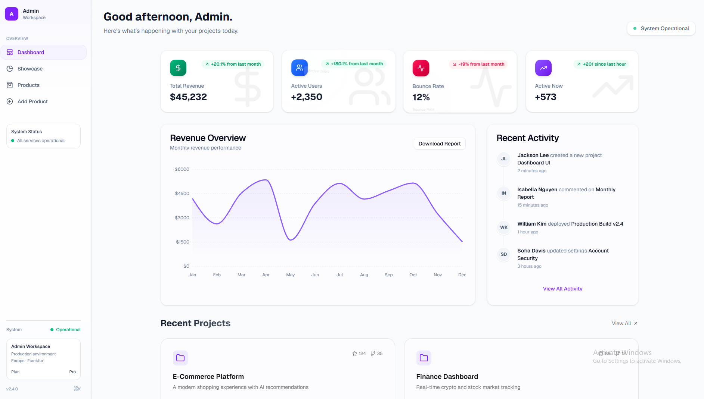
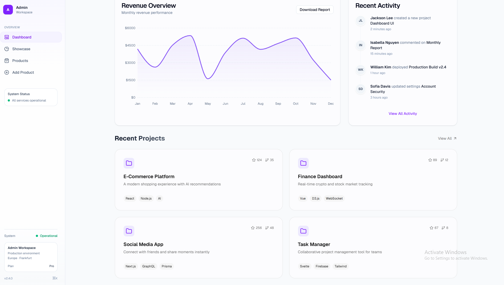
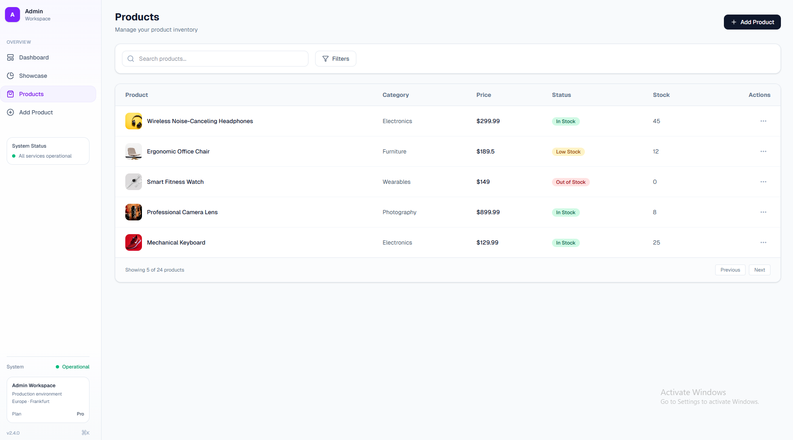
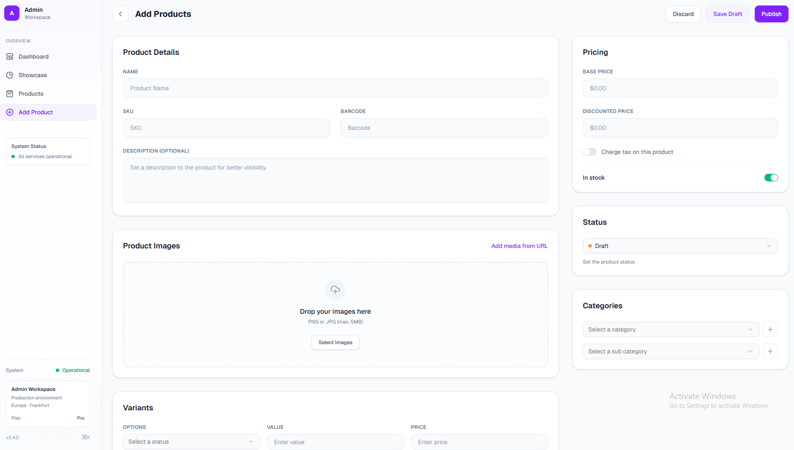
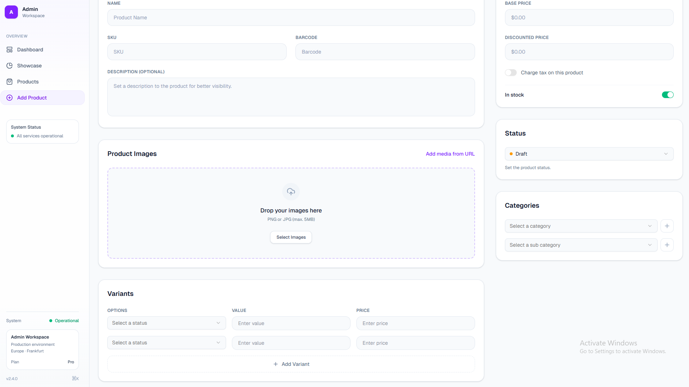
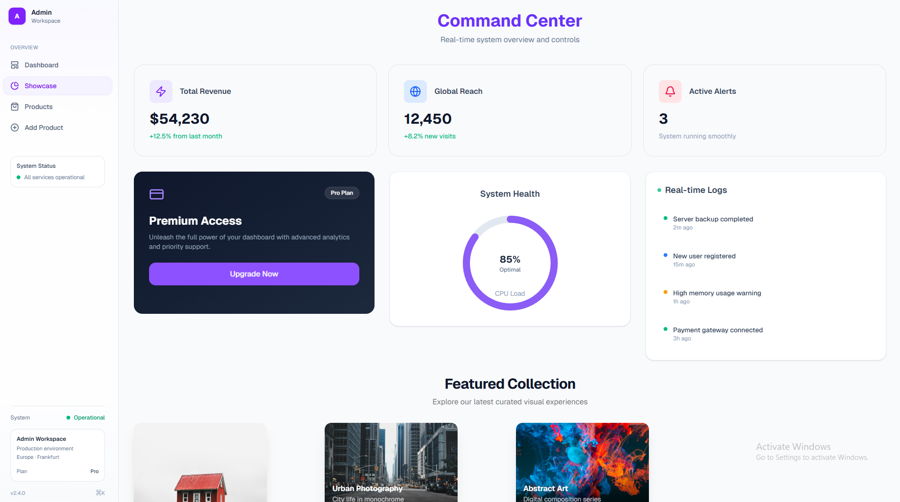

# Next.js Portfolio & Dashboard Showcase

<p align="center">
  <b>A comprehensive collection of modern web applications showcasing frontend excellence</b><br/>
  Built with Next.js 16, React 19, and cutting-edge UI technologies
</p>

<p align="center">
  
  
</p>

<p align="center">
  
  
  
  
  
</p>

---

## Table of Contents

- [What's Inside](#whats-inside)
- [Key Capabilities](#key-capabilities)
- [Dashboard Elements](#dashboard-elements)
- [Portfolio Elements](#portfolio-elements)
- [Project Structure](#project-structure)
- [Technology Stack](#technology-stack-summary)
- [Getting Started](#getting-started)
- [Live Deployments](#live-deployments)
- [Use Cases](#use-cases)
- [Skills Showcased](#skills-showcased)
- [Documentation](#documentation)
- [Connect](#connect)

---

## What's Inside

This repository contains two major projects that demonstrate professional-grade frontend development:

### [Dashboard Elements](./Dashboard)
A modern, component-driven admin dashboard focused on real-world workflows and clean UI architecture.

**Live Demo:** [dashboard-elements.vercel.app/admin](https://dashboard-elements.vercel.app/admin)

### [Portfolio Elements](./Elements)
A curated collection of 5 unique portfolio themes, each exploring different visual personalities and motion-first interactions.

**Live Demo:** [portfolio-elements-omega.vercel.app](https://portfolio-elements-omega.vercel.app/)

---

## Key Capabilities

### Frontend Excellence
- **Modern React Patterns** — Leveraging React 19 features
- **Next.js 16** — Server and client-side rendering
- **Component Architecture** — Scalable, reusable, and maintainable
- **Advanced Styling** — Tailwind CSS with custom design systems
- **Motion Design** — Framer Motion for smooth animations

### Technical Skills Demonstrated

**UI/UX Development**
- Responsive design — mobile-first, tablet-optimized, desktop-ready
- Design systems — consistent theming across applications
- Accessibility — WCAG-compliant components
- Animation — purposeful micro-interactions and transitions

**Component Libraries**
- Radix UI — headless component primitives
- Data visualization — chart libraries for analytics
- Form handling — complex form validation and UX
- State management — modern React state patterns

**Production-Ready Features**
- Performance optimized — fast load times and smooth interactions
- Type safety — well-structured component props
- Clean architecture — separation of concerns
- Deployment ready — Vercel-optimized builds

---

## Dashboard Elements

### Overview
A frontend-first admin panel designed for modern dashboards, with emphasis on scalability and real-world workflows.

### Features

**Admin Dashboard**

<p align="center">
  
  
</p>

- Analytics overview — stats cards and KPI displays
- Data visualization — interactive charts using Recharts
- Animated UI — smooth transitions and micro-interactions
- Real-time updates — dynamic data presentation

**Product Management**

<p align="center">
  
  
  
</p>

- Product listings — organized table/grid views
- CRUD operations — add, edit, delete workflows
- Form components — validated input fields
- Search & filter — advanced data filtering

**UI Showcase**

<p align="center">
  
</p>

- Component library — reusable UI elements
- Radix integration — dropdowns, dialogs, switches
- Motion patterns — consistent animation system

### Tech Stack
Next.js 16 · React 19 · Tailwind CSS · Recharts · Framer Motion · Radix UI · Lucide React

**[→ View Full Dashboard Documentation](./Dashboard/README.md)**

---

## Portfolio Elements

### Overview
Five distinct portfolio themes showcasing different visual personalities and animation approaches — from minimal, content-first designs to experimental, motion-heavy layouts.

### Themes Collection

**Theme One — Minimal Portfolio**

<p align="center">
  
</p>

- Content-first design — typography and spacing focused
- Clean layout — distraction-free experience
- Responsive — consistent across devices

**Theme Two — Animated Portfolio**

<p align="center">
  
</p>

- Motion storytelling — scroll-based animations
- Progressive reveal — guided content flow
- Dynamic interactions — engaging user experience

**Theme Three — Business Portfolio**

<p align="center">
  
</p>

- Product-style sections — SaaS-inspired layout
- Conversion-focused — clear CTAs and hierarchy
- Performance-first — optimized for speed

**Theme Four — Creative Portfolio**

<p align="center">
  
</p>

- Visual impact — bold, expressive layouts
- Fluid transitions — immersive experience
- Strong identity — memorable design language

**Theme Five — Experimental Portfolio**

<p align="center">
  
</p>

- Innovative patterns — beyond conventional layouts
- Expressive motion — animation as art
- Standout design — unique visual approach

### Common Features Across Themes
- Mobile-first — optimized for all devices
- Customizable — easy theming and branding
- Reusable components — modular architecture
- Fast performance — production-optimized

### Tech Stack
Next.js 16 · React 19 · Tailwind CSS · CVA · Lucide React · clsx & tailwind-merge

**[→ View Full Portfolio Documentation](./Elements/README.md)**

---

## Project Structure

```txt
nextjs-Portfolio/
│
├── Dashboard/              # Admin dashboard application
│   ├── src/
│   │   ├── app/            # Next.js app directory
│   │   ├── components/     # Dashboard, Products, UI components
│   │   ├── const/          # Constants and config
│   │   └── lib/            # Utilities
│   ├── assets/              # Dashboard screenshots
│   └── README.md           # Dashboard documentation
│
├── Elements/               # Portfolio themes collection
│   ├── src/
│   │   ├── app/            # Next.js app directory
│   │   ├── components/     # Theme components
│   │   ├── data/           # Content data
│   │   └── lib/            # Utilities
│   ├── assets/              # Theme screenshots
│   └── README.md           # Portfolio documentation
│
└── README.md               # This file
```

---

## Technology Stack Summary

**Core Framework**
- Next.js 16 — App router, server components, optimizations
- React 19 — Latest React features and patterns
- TypeScript — Type-safe development

**Styling & Design**
- Tailwind CSS — Utility-first CSS framework
- class-variance-authority — Component variants
- clsx — Conditional classnames
- tailwind-merge — Merge Tailwind classes
- tailwindcss-animate — Animation utilities

**UI Components**
- Radix UI — Accessible headless components (dialogs, dropdowns, selects, switches, and more)
- Lucide React — Icon library

**Animation**
- Framer Motion — Production-ready animations
- Motion — Lightweight animation library

**Data Visualization**
- Recharts — Composable chart library

**Development Tools**
- npm — Package management
- Vercel — Deployment platform
- ESLint — Code quality

---

## Getting Started

### Prerequisites
- Node.js 18+
- npm or yarn

### Dashboard Application
```bash
cd Dashboard
npm install
npm run dev
```
Visit [http://localhost:3000/admin](http://localhost:3000/admin)

### Portfolio Elements
```bash
cd Elements
npm install
npm run dev
```
Visit [http://localhost:3000](http://localhost:3000)

### Production Build
```bash
# In each project directory
npm run build
npm start
```

---

## Live Deployments

Both projects are deployed on Vercel with optimized production builds:

- **Dashboard:** [dashboard-elements.vercel.app/admin](https://dashboard-elements.vercel.app/admin)
- **Portfolio:** [portfolio-elements-omega.vercel.app](https://portfolio-elements-omega.vercel.app/)

---

## Use Cases

**Dashboard Elements**
- Admin panel starter for SaaS applications
- UI reference for data-heavy interfaces
- Component library for internal tools
- Analytics dashboard foundation

**Portfolio Elements**
- Portfolio websites for developers and designers
- Landing pages for personal brands
- Theme showcase for clients
- Responsive design reference

---

## Skills Showcased

**Frontend Development**
- Modern React patterns and hooks
- Next.js App Router architecture
- Server and client component composition
- Advanced TypeScript usage
- Performance optimization techniques

**UI/UX Engineering**
- Responsive design implementation
- Animation and micro-interactions
- Accessible component development
- Design system creation
- Cross-browser compatibility

**Code Quality**
- Clean, maintainable architecture
- Reusable component patterns
- Separation of concerns
- Best practices and conventions
- Production-ready code

**Tools & Workflows**
- Git version control
- Modern build tools
- CI/CD with Vercel
- Package management
- Development workflows

---

## Documentation

For detailed information about each project:

- **Dashboard Documentation:** [Dashboard/README.md](./Dashboard/README.md)
- **Portfolio Documentation:** [Elements/README.md](./Elements/README.md)

---

## License

Both projects are available for portfolio demonstration and learning purposes.

---

## Connect

Built to showcase modern frontend development capabilities. Each project represents a commitment to clean code, user experience, and production-quality standards.

**Portfolio Highlights:**
- Modern tech stack mastery
- Design-to-code implementation
- Scalable architecture patterns
- Production deployment experience
- Real-world application development

- Modern tech stack mastery
- Design-to-code implementation
- Scalable architecture patterns
- Production deployment experience
- Real-world application development

---

<p align="center">
  <b>Built with Next.js 16, React 19, and modern frontend technologies</b>
</p>
